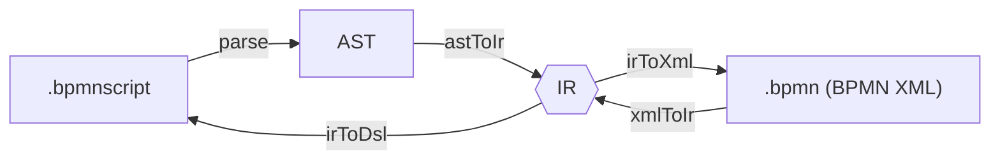

# BPMNscript

A textual domain-specific language for authoring BPMN 2.0 processes, with IDE support through VS Code.

BPMN (Business Process Model and Notation) is a standard notation for modeling business workflows as diagrams of tasks, gateways, and events; a process engine such as [Operaton](https://operaton.org/) runs those diagrams. A _domain-specific language_ (DSL) is a small language built for one job — here, describing a BPMN process as readable text instead of drawing it in a graphical editor or hand-writing the BPMN XML underneath. BPMNscript is that text format, plus the tooling to turn it into deployable BPMN and back.

It's being developed as part of a bachelor's thesis at [University of Hamburg](https://www.uni-hamburg.de/), supervised by Dr. Oliver Kopp. The thesis investigates whether a text-based DSL can serve as a practical alternative to graphical BPMN editors for developers who prefer working in code.

## What it does

- Compiles `.bpmnscript` source files to BPMN 2.0 XML with auto-generated diagram layout, ready for deployment to Operaton.
- Decompiles BPMN 2.0 XML back to `.bpmnscript` source. Constructs the DSL cannot express (event definitions, loop characteristics, collaborations) are refused with an actionable error instead of being dropped; non-semantic content the IR doesn't carry (extra Operaton extension attributes, lanes) is dropped with a warning, not silently.
- Provides a VS Code extension with syntax highlighting, inline error diagnostics, and a sidebar "Convert" panel that compiles the open file, jumps to its counterpart, or decompiles a BPMN file you pick from disk. The same conversions are in the command palette.
- Validates code at authoring time: undeclared variable references, type mismatches in conditions, duplicate attribute/process/variable/step names, empty branches, and `goto` targets that fail to resolve or reach into a `parallel` branch from outside it.

The DSL currently covers start events, end events, user tasks, service tasks, exclusive gateways, parallel gateways, and structured control flow (`if`/`else if`/`else`, `while`, `do…while`, `parallel`). Element labels are optional: when omitted, the BPMN `name` is derived from the identifier (`invoice-approval` → "Invoice Approval"), and an explicit quoted label overrides it.

## Quick start

```sh
npm install
npm run build
npm test
```

`npm test` includes Docker-based end-to-end tests that boot an Operaton engine via [testcontainers](https://testcontainers.com/). These require a running Docker daemon. To skip them, set `SKIP_DOCKER_TESTS=true` (CI does this automatically).

## CLI usage

After building, run the CLI with `npx`:

```sh
# Compile .bpmnscript to BPMN 2.0 XML
npx bpmns build examples/spring-boot/processes/invoice-approval.bpmnscript

# With explicit output path
npx bpmns build invoice-approval.bpmnscript -o out/invoice-approval.bpmn

# Decompile BPMN XML back to DSL
npx bpmns parse invoice-approval.bpmn -o invoice-approval.bpmnscript
```

Exit codes: `0` success, `1` validation/parse errors, `2` I/O errors. `bpmns parse` prints any non-fatal import warnings (dropped extension attributes, lanes) to stderr without changing the exit code; a BPMN construct it cannot import at all exits `1` with an actionable message instead of writing a partial `.bpmnscript` file.

## Architecture

The transformation pipeline routes both the compile and decompile directions through a shared intermediate representation (IR). See [ADR-0006](docs/decisions/0006-engine-agnostic-intermediate-representation.md) for the rationale.



A `.bpmnscript` file is first parsed into an **AST** (abstract syntax tree — the parser's structured, in-memory view of the source). The AST is converted into the **IR**, a small set of plain TypeScript objects (`packages/transform/src/ir/types.ts`) that describe the process without any tie to a specific engine. Everything funnels through the IR: each transform only has to know how to convert _to_ or _from_ it, not to every other format directly. From the IR, one transform writes BPMN XML and another writes DSL text — so the same hub serves both compiling (`.bpmnscript` → AST → IR → `.bpmn`) and decompiling (`.bpmn` → IR → `.bpmnscript`).

The IR stays vendor-neutral. Operaton-specific attributes (`operaton:class`, `operaton:assignee`, and so on) are added only at the final XML-serialization step, through a local [moddle extension](packages/transform/src/operaton-moddle.json) — keeping the engine's quirks out of the core data model.

| Library                                                         | Role                                                |
| --------------------------------------------------------------- | --------------------------------------------------- |
| [Langium](https://langium.org/)                                 | Grammar, parser, AST, LSP server, VS Code extension |
| [bpmn-moddle](https://github.com/bpmn-io/bpmn-moddle)           | BPMN 2.0 XML reading and writing                    |
| [bpmn-auto-layout](https://github.com/bpmn-io/bpmn-auto-layout) | Generates diagram layout data on export             |

## Repository structure

```text
packages/
  language/      Langium grammar, AST, validator, language server
  transform/     IR types and bidirectional transforms (AST/IR/XML/DSL)
  cli/           bpmns build / parse commands
  extension/     VS Code extension: language server, compile/decompile commands, sidebar
tests/           Round-trip, fixture, and end-to-end tests
examples/
  spring-boot/   Operaton + Spring Boot Docker fixture for e2e testing
```

See [examples/spring-boot/README.md](examples/spring-boot/README.md) for instructions on running the Operaton fixture.

## Architectural decisions

Design decisions are documented as [Markdown ADRs](docs/decisions/) using [MADR 4.0.0](https://adr.github.io/madr/).

## Glossary

Terms that show up across the READMEs, the ADRs, and the code:

- **BPMN 2.0** — Business Process Model and Notation. The standard for describing business workflows as diagrams of tasks, gateways, and events. BPMNscript compiles to BPMN 2.0 XML.
- **DSL** — domain-specific language. A small language built for one narrow purpose. BPMNscript is a DSL for writing BPMN processes as text.
- **Operaton** — the process engine this project targets. It loads a BPMN file and executes the workflow it describes.
- **Langium** — the TypeScript toolkit used to build the language. From one grammar file it generates the parser, the AST types, and a language server. See [ADR-0002](docs/decisions/0002-use-langium-as-language-workbench.md).
- **Grammar** — the file (`bpmn-script.langium`) that defines the DSL's syntax: which keywords and shapes are valid. Langium turns it into a parser.
- **Parser** — the code that reads `.bpmnscript` text and builds the AST. Generated by Langium from the grammar.
- **AST** — abstract syntax tree. The parser's structured, in-memory representation of a source file (nodes for each `process`, `user`, `service`, `if`, `while`, `parallel`, and so on).
- **IR** — intermediate representation. A small set of plain objects (`packages/transform/src/ir/types.ts`) that every transform reads from or writes to. Shared by every transform in both directions; see [ADR-0006](docs/decisions/0006-engine-agnostic-intermediate-representation.md).
- **Validator** — checks that a parsed process is structurally sound and reports errors in the editor. The full list of checks is in [packages/language/README.md](packages/language/README.md#validator-checks).
- **LSP** — Language Server Protocol. The standard that lets one language server provide highlighting, autocompletion, and inline errors to any editor that speaks it. Langium implements it for us; the VS Code extension is the host.
- **moddle / bpmn-moddle** — the library that reads and writes BPMN XML as objects. A _moddle extension_ (here, `operaton-moddle.json`) teaches it about the extra `operaton:` attributes.
- **DI** — diagram interchange. The `<bpmndi:...>` part of a BPMN file that stores diagram coordinates (where each box sits). BPMNscript regenerates it automatically on export; see [ADR-0003](docs/decisions/0003-auto-layout-for-diagram-interchange.md).
- **MIWG** — the Model Interchange Working Group. Its interoperability conventions (such as explicit `<bpmn:incoming>`/`<bpmn:outgoing>` references on every node) are what Operaton expects in a BPMN file.
- **Golden file** — a known-good reference output checked into the repo so a test can diff against it instead of recomputing the expected result. See [tests/golden/README.md](tests/golden/README.md).
- **Monorepo / workspace** — this repo holds several npm packages (`packages/*`) in one place; npm "workspaces" link them so they can depend on each other without publishing. See [ADR-0005](docs/decisions/0005-use-mono-repo-structure.md).

## Contributing

See [CONTRIBUTING.md](CONTRIBUTING.md).

## License

[Apache-2.0](LICENSE)
