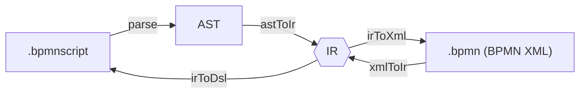

# BPMNscript

Write executable business processes as text, compile to BPMN 2.0 XML, and read existing BPMN files back as text.

> **Status:** a bachelor's thesis project, pre-release.
> It is not published to npm or the VS Code Marketplace yet, so everything below builds from source.

## What it is

BPMN 2.0 is the standard for describing a business workflow as a diagram of tasks, gateways, and events.
A process engine such as [Operaton](https://operaton.org/) loads that diagram and runs it: assigning the human steps to people, calling the automated ones, waiting on timers and incoming messages.
The diagram is stored as XML, and the XML is what actually gets deployed.

Usually you draw it in a graphical modeler.
BPMNscript gives BPMN a textual representation:

```bpmnscript
process invoice-approval {
  start ReviewStart {
    form {
      amount: number "Invoice amount"
    }
  }
  user ReviewInvoice(assignee: "demo")
  if (amount > 1000) {
    user SeniorApproval(assignee: "manager")
  } else {
    service AutoApprove(class: "com.example.invoice.AutoApproveDelegate")
  }
  end Done
}
```

Compiling this gives you a valid BPMN 2.0 file that a graphical modeler opens as a diagram and Operaton deploys.

## Who it's for

Developers who'd rather work in a text editor than a diagram canvas, and who want processes to fit into their existing code workflow: git and diffs, autocompletion, and compile-time error checking.

You don't need to know BPMN to read or write BPMNscript.
The keywords say what a step does rather than mirroring the BPMN element behind them.
The diagram comes for free: describe a valid workflow and the tool draws it, so there are no lines to route, nothing to align, and no redoing a layout because one changed step spoiled it.

## Installing

You'll need Node.js 22 or newer and npm 10.2.3 or newer.

```sh
git clone https://github.com/BPMNscript/bpmnscript.git
cd bpmnscript
npm install
npm run build
```

`npm run build` generates the parser from the grammar, compiles every package, and bundles the VS Code extension.

To check it worked:

```sh
npm test
```

The test run includes end-to-end tests that boot a real Operaton engine in Docker via [testcontainers](https://testcontainers.com/), so it needs a running Docker daemon.
Without one, set `SKIP_DOCKER_TESTS=true` to skip them; CI runs them.

## Documentation

- [packages/language/README.md](packages/language/README.md): the language reference, every statement and the keys it takes
- [packages/transform/README.md](packages/transform/README.md#the-import-contract): the import contract, what a decompile refuses, drops, or warns about
- [docs/bpmn-coverage.md](docs/bpmn-coverage.md): the BPMN coverage table, every element kind against the statement that writes it and what the importer does with it
- [packages/cli/README.md](packages/cli/README.md): the `bpmns` command, its flags and exit codes
- [packages/extension/README.md](packages/extension/README.md): the VS Code extension, how it is built, installed, and packaged
- [docs/decisions/](docs/decisions/): the architectural decision records, why things are the way they are
- [docs/glossary.md](docs/glossary.md): the shared vocabulary

## Using the CLI

The `bpmns` command has two subcommands.
After a build, run it with `npx`:

```sh
# Compile .bpmnscript to BPMN 2.0 XML, next to the source file
npx bpmns build examples/spring-boot/processes/invoice-approval.bpmnscript

# Choose the output path
cd examples/spring-boot/processes
npx bpmns build invoice-approval.bpmnscript -o out/invoice-approval.bpmn

# Decompile BPMN XML back to the DSL
npx bpmns parse out/invoice-approval.bpmn -o out/invoice-approval.bpmnscript
```

Exit codes are `0` for success, `1` for validation errors on `build` or a refused BPMN construct on `parse`, and `2` for an I/O problem or input that cannot be read as BPMN XML.
Both directions print non-fatal warnings to stderr without changing the exit code, so an undeclared variable reference on compile, or a dropped lane on import is warned about but still produces a file.
`parse` also re-validates the script it wrote and lists every error `build` would draw from it, still with exit `0`.
Both commands read a file from disk, never stdin, refuse to overwrite an existing output unless you pass `--force`, and refuse the input path itself even then; see [packages/cli/README.md](packages/cli/README.md) for the exact rules.

## Using the VS Code extension

Press <kbd>F5</kbd> from the repo root.
VS Code opens a second window with the extension loaded, where `.bpmnscript` files get:

- syntax highlighting, including inside a `script` task's fenced body, which is highlighted in its own language (JS, Groovy, Python and Ruby; no FEEL grammar is wired in, so it stays plain)
- completion, hover, go to definition, find all references and rename, for steps, codes and variables, plus an outline, from the same grammar that drives the compiler
- errors and warnings inline as you type, so a `goto` that can't reach its target, a `string` variable under an ordered comparison, or a `boolean` in arithmetic is flagged before you ever run the compiler
- a **Convert** panel in the sidebar: compile the open file, jump to its counterpart when one exists, or pick a `.bpmn` from disk to decompile

For a normal install instead of the development host, see the extension README's [Installing](packages/extension/README.md#installing) section.
Compiling and decompiling are the same two operations as `bpmns build` and `bpmns parse` above, without leaving the editor.
Both are in the command palette too, under "BPMNscript".
See [packages/extension/README.md](packages/extension/README.md) for how the pieces fit together.

## The language

One `process` block per file.
Steps run top to bottom, so you never write a sequence flow; control flow is expressed with the structured statements you'd expect from a programming language.
Every step carries an id (`user ReviewInvoice`), which is what `goto` and boundary events refer to.
A step, a call and a sub-process take their diagram name from that id (`ReviewInvoice` -> "Review Invoice") unless a `label` setting gives one instead; a `start` and an `end` are named by `label` alone, and their id is never humanized into a name.
The event statements `on`, `throw`, `emit` and `await` are the exception: their id is a jump target only, so they take no `label` and show no name at all, except on the two ends of a link pair, which carry their link name.

| BPMNscript                                  | What it means                                                                                              | BPMN element                                                                                                   |
| ------------------------------------------- | ---------------------------------------------------------------------------------------------------------- | -------------------------------------------------------------------------------------------------------------- |
| `process X { }`                             | the bpmn process, one per file                                                                             | `bpmn:process`                                                                                                 |
| `var x: number`                             | declare a variable so its uses get type-checked                                                            | none; the importer declares `var x: any` for every variable the printed script reads and nothing else declares |
| `start X` / `end X`                         | where the flow begins and ends                                                                             | start / end event                                                                                              |
| `start X <kind>(...)`                       | start when an event arrives                                                                                | start event with a trigger                                                                                     |
| `end X terminate`                           | stop every running path                                                                                    | terminate end event                                                                                            |
| `end X cancel`                              | give up the block of steps around this end                                                                 | cancel end event                                                                                               |
| `form { x: number "Label" }`                | a form on a `start` or a `user` step; on a start it pre-fills variables                                    | form fields on the start event or user task                                                                    |
| `user X(assignee: "...")`                   | a step a person performs                                                                                   | user task                                                                                                      |
| `service X(class: "...")`                   | a step the system performs, in the engine                                                                  | service task                                                                                                   |
| `service X(topic: "...")`                   | a step an external worker picks up by topic                                                                | service task, external type                                                                                    |
| `service X(type: "shell")`                  | a step the engine runs itself, a shell command or a mail                                                   | service task, built-in type                                                                                    |
| `script X` + a fenced body                  | an inline script, in JS, Groovy, Python, Ruby or FEEL                                                      | script task                                                                                                    |
| `step X`                                    | a step nothing in the engine automates                                                                     | task                                                                                                           |
| `send X(class: "...")`                      | a step that sends something out                                                                            | send task                                                                                                      |
| `receive X(message: "...")`                 | wait here until that message arrives                                                                       | receive task                                                                                                   |
| `decide X(decision: "...")`                 | a step a decision table answers                                                                            | business rule task                                                                                             |
| `if` / `else if` / `else`                   | a decision                                                                                                 | exclusive gateway                                                                                              |
| `while` / `do ... while`                    | a loop                                                                                                     | exclusive gateway loop                                                                                         |
| `parallel { { } { } }`                      | branches that run at the same time                                                                         | parallel gateway fork and join                                                                                 |
| `parallel { if (c) { } else { } }`          | the branches whose condition holds run, or the `else` branch when none does                                | inclusive gateway fork and join                                                                                |
| `subprocess X { }`                          | a group of steps as one unit                                                                               | embedded sub-process                                                                                           |
| `attempt X { }`                             | a group of steps that can be given up as one                                                               | transaction sub-process                                                                                        |
| `call X(process: "other")`                  | start another process and wait for it                                                                      | call activity                                                                                                  |
| `goto X`                                    | jump to a named step in the same container                                                                 | sequence flow                                                                                                  |
| `on <kind> { }`                             | catch an event anywhere in this body                                                                       | event sub-process                                                                                              |
| `on Host: <kind> { }`                       | catch an event only while `Host` runs                                                                      | boundary event                                                                                                 |
| `await <kind>(...)`                         | stop here until the event arrives                                                                          | intermediate catch event                                                                                       |
| `await { <kind>(...) { } <kind>(...) { } }` | wait on several triggers, continue down whichever fires first                                              | event-based gateway, a catch event per branch, exclusive join                                                  |
| `throw` / `emit <kind>`                     | raise an event, ending the path or continuing                                                              | throw event                                                                                                    |
| `emit link("X")` / `await link("X")`        | jump to the catch of the same name, a diagram's off-page connector                                         | intermediate throw and catch event, with no flow between them                                                  |
| `for each x in c`                           | run a step once per item, or a set number of times                                                         | multi-instance marker                                                                                          |
| `asyncBefore: true`                         | engine settings: async, exclusive, priority, retries, or, with a `run` prefix, on each run of a repetition | `operaton:` attribute/element                                                                                  |
| `input x = "..."`                           | data into a step's execution, and `output` back out                                                        | `operaton:inputOutput`                                                                                         |
| `on create(class: "...")`                   | code on a step's lifecycle, not a caught event                                                             | execution / task listener                                                                                      |

The `for` row is a modifier rather than a statement: every activity in the table takes it between the id and the parens, meaning `user`, `service`, `script`, `step`, `send`, `receive`, `decide`, `subprocess`, `attempt`, and `call`.
The last three rows are members of an element rather than statements: an engine setting joins the rest in the `( )`, a parameter and a listener go in the `{ }`, and not every element takes every one.
The process header's own settings are written with the other process declarations.
The listener row reuses `on` instead of opening a new event sub-process; the body block a handler always carries and a listener never does is what tells the two apart ([ADR-0020](docs/decisions/0020-listeners-reuse-on-inside-the-attribute-block.md)).
The `attempt` head and the `cancel` end are one construct: the end gives up the block it sits in, `on <block>: cancel` beside the block catches it, and the block's finished steps that carry an `on compensation` block (the undo block) are undone in between.

[packages/language/README.md](packages/language/README.md) is the full specification: which keys each element takes, which elements take parameters and listeners, and what a conditioned `parallel` branch compiles to.

### Events

The event layer reads like try/catch.
A handler written at the end of a body catches an event raised anywhere inside it, `throw` ends the current path the way `throw` does in Java, and `emit` fires the event and carries on.
`emit link` is the one emit that ends the path instead: the token continues at the `await link` of the same name, which is how a diagram's off-page connector reads ([packages/language/README.md](packages/language/README.md#link-events)).
Every trigger kind but `cancel` and `link` opens such a handler, `cancel` being caught on the block it gives up and `link` by its `await`; the table in [packages/language/README.md](packages/language/README.md#the-event-layer) gives each kind with its payload.
A message, a signal, a timer, or a condition can also start a process, carrying the same payload it does as a handler, and a `terminate` end stops every running path at once.
An error or escalation code is declared in the process header, beside the `var` declarations, and named at every throw, emit, and catch site, and in an external task's `error <Code> when <condition>` mapping.

A handler can also attach to one step instead of the whole body, which is where `on Host: kind` comes in.
This process reviews an order, takes payment in a sub-process, and hangs four different escapes off those two activities:

```bpmnscript
process order-handling {
  error PAYMENT_DECLINED(message: "The card could not be charged")
  escalation LARGE_PAYMENT_FLAGGED

  start OrderPlaced
  user ReviewOrder(label: "Review order", assignee: "demo")

  subprocess Payment(label: "Process payment") {
    service AuthorizePayment(label: "Authorize payment", class: "com.example.demo.LogDelegate")
    emit escalation(LARGE_PAYMENT_FLAGGED)
    service CapturePayment(label: "Capture payment", class: "com.example.demo.LogDelegate")
  }

  service ShipOrder(label: "Ship order", class: "com.example.demo.LogDelegate")
  end OrderShipped

  on ReviewOrder: timer("PT4H", alongside) {
    service SendReviewReminder(label: "Send a review reminder", class: "com.example.demo.LogDelegate")
  }

  on ReviewOrder: message("AutoApproved") {
    service MarkAutoApproved(label: "Mark the order auto-approved", class: "com.example.demo.LogDelegate")
    goto Payment
  }

  on Payment: error(PAYMENT_DECLINED, code: c, message: m) {
    user ContactCustomer(label: "Contact the customer about the decline", assignee: "demo")
  }

  on Payment: escalation(LARGE_PAYMENT_FLAGGED, alongside) {
    user ReviewLargePayment(label: "Review the large payment", assignee: "manager")
  }
}
```

`alongside` is the difference between interrupting the step and running beside it.
The four-hour timer nudges the reviewer while review stays open; the `AutoApproved` message cancels the review outright and jumps to payment.
The declined-card error kills the payment sub-process and hands the customer to an agent, and the large-payment escalation pulls in a manager without stopping the capture.

### Compensation

A `subprocess` can carry an `on compensation` block: the steps that undo whatever it already did.
When something later fails, the completed units unwind newest first.

```bpmnscript
process booking-saga {
  error BOOKING_FAILED(message: "A booking step could not be completed")

  start TripRequested
  user ReviewTrip(label: "Review the trip", assignee: "demo")

  subprocess BookFlight(label: "Book the flight") {
    service ReserveSeat(label: "Reserve the seat", class: "com.example.demo.LogDelegate")

    on compensation {
      service ReleaseSeat(label: "Release the seat", class: "com.example.demo.LogDelegate")
    }
  }

  subprocess BookHotel(label: "Book the hotel") {
    service ReserveRoom(label: "Reserve the room", class: "com.example.demo.LogDelegate")

    on compensation {
      service ReleaseRoom(label: "Release the room", class: "com.example.demo.LogDelegate")
    }
  }

  service ConfirmTrip(label: "Confirm the trip", class: "com.example.demo.LogDelegate")
  end TripConfirmed

  on error(BOOKING_FAILED) {
    emit compensation Undo
    user NotifyTraveler(label: "Notify the traveler", assignee: "demo")
  }
}
```

Book the hotel after the flight, then fail: the seat gets released, and the traveler gets told.

The invoice-approval and order-handling programs above are files from [examples/spring-boot/processes/](examples/spring-boot/processes/), the second with one boundary handler left out; the compensation one is written for this page, and `compensating-saga.bpmnscript` is its deployable counterpart.
The end-to-end suite deploys several of that directory's processes to an Operaton engine and asserts what the engine does with them.

## Roundtripping BPMN XML -> BPMNscript

BPMN is a much larger language than this DSL, so a `.bpmn` file can hold more than a `.bpmnscript` has a form for.
A decompile deals with that in three ways.

- A construct the DSL cannot express (an ad hoc subprocess, a compensation boundary event, an event definition the language doesn't model) is refused with an error and nothing is written, and so is a shape Operaton refuses to deploy, such as an exclusive gateway with two unconditioned routes or an `operaton:inputOutput` on a gateway.
- Content the intermediate representation doesn't carry (a pool, a lane, a text annotation, a listener found on a gateway, a manual task, a standard loop, a data object) is dropped with a warning naming each item, and so is an `isExecutable="false"`, which imports as executable whatever the source said.
  The exceptions are attributes the importer doesn't read.
- What the print hop cannot carry into the script is warned about too, and those warnings are the ones to read before building the output.
  A gateway's name merely drops, since the script derives its splits and merges from block structure and no statement is left to carry one.
  A fork whose branches all carry conditions and that named no fallback changes what a recompiled document runs, because the printed block falls through where the model stops with a stuck execution.
  A route with no `goto` target to jump to is left out entirely, replaced by a `// unstructured region: hand-repair required` comment naming the element it led into.
  An `else` beside a branch that runs whatever the conditions do prints a fallback nothing can reach, and the validator then rejects the script `bpmns parse` just wrote.
  An id the script cannot spell is respelled and the change is reported, since the engine keys history, a migration plan and a start-before-activity on that id, so a rebuilt document does not run as the same process.
  A jump into a step reached from outside the `await` or `parallel` branch it printed in is still written and reported, and the validator then refuses it once `bpmns parse` reads the script back, because a branch's steps run only when the whole block is reached.
  A split or wait left with no route out is dropped from the script outright, and the warning names what the engine does in its place, from ending the run the same way to refusing to deploy the model at all.

A branch that only rejoins the block's tail may print after the block instead, reached by a `goto`, and the block's join may be replaced by direct edges into that tail; the set of steps and their order along each path is unchanged, so this restructuring prints with no warning at all.

What each hop reports, item by item, is the import contract in [packages/transform/README.md](packages/transform/README.md#the-import-contract) and the print warnings in [packages/transform/README.md](packages/transform/README.md#print-warnings).
[ADR-0014](docs/decisions/0014-restructure-the-ir-into-a-dsl-with-dominator-analysis.md) covers which shapes degrade and why.

Every engine setting a modeler tunes imports warning-free; the IR shape in [packages/transform/README.md](packages/transform/README.md#ir-shape) lists each one.
A user task assigned in BPMN's own words, a `bpmn:humanPerformer` or a `bpmn:potentialOwner`, imports onto the same `assignee`, `candidateUsers` and `candidateGroups` the engine reads it into, with a warning naming the rewrite ([ADR-0012](docs/decisions/0012-honest-bpmn-import.md)).
A link throw is one exception: each engine setting and listener on one warns, because Operaton creates no activity for a link throw and so never reads them ([ADR-0030](docs/decisions/0030-link-events-for-import-round-trip-symmetry.md)).
`asyncAfter` on an event-based gateway is the other: the import refuses it, as Operaton refuses to deploy it ([ADR-0021](docs/decisions/0021-operaton-engine-attributes-as-named-ir-fields.md)).
What stays out of reach is a setting with nowhere to sit in the text.
That is a listener or an input/output parameter on a synthesized gateway, a setting on the `bpmn:process` element, or a job priority on the repetition element, which the engine reads off the step alone.

The reasoning is in [ADR-0012](docs/decisions/0012-honest-bpmn-import.md).
The short version: a round trip that changes the model/workflow without warning is worse than one that refuses to run.

## Running a process on a real engine

[examples/spring-boot/](examples/spring-boot/) is a working Operaton 2.1.0 + Spring Boot deployment with Java delegates for the service tasks.
Its [README](examples/spring-boot/README.md) walks through compiling the processes, starting the engine, opening Cockpit and Tasklist, and stepping through a loan approval example process by hand.

## Architecture

Both directions route through a shared intermediate representation.
Each transform only has to know how to convert to or from the IR, never to every other format directly.


```mermaid
flowchart LR
    SRC[".bpmnscript"]
    AST["AST"]
    IR{{"IR"}}
    BPMN[".bpmn (BPMN XML)"]

    SRC -- parse --> AST
    AST -- astToIr --> IR
    IR -- irToXml --> BPMN
    BPMN -- xmlToIr --> IR
    IR -- irToDsl --> SRC
```

A source file is parsed into an AST, converted into the IR (a small set of plain TypeScript objects in `packages/transform/src/ir/types.ts` that describe a process in the engine's own terms, tied to no file format), and written out from there.
Compiling is `.bpmnscript` -> AST -> IR -> `.bpmn`; decompiling is `.bpmn` -> IR -> `.bpmnscript`.

The IR carries Operaton's semantics under names with no vendor prefix: the engine's bindings, execution settings, input/output parameters and lifecycle listeners are all plain-named IR fields, and `operaton:` is applied only where `irToXml` builds the moddle element from a local [moddle extension](packages/transform/src/operaton-moddle.json) ([ADR-0007](docs/decisions/0007-intermediate-representation-ast-bpmn.md), [ADR-0021](docs/decisions/0021-operaton-engine-attributes-as-named-ir-fields.md), [ADR-0020](docs/decisions/0020-listeners-reuse-on-inside-the-attribute-block.md)).

| Library                                                         | Role                                                |
| --------------------------------------------------------------- | --------------------------------------------------- |
| [Langium](https://langium.org/)                                 | Grammar, parser, AST, LSP server, VS Code extension |
| [bpmn-moddle](https://github.com/bpmn-io/bpmn-moddle)           | BPMN 2.0 XML reading and writing                    |
| [bpmn-auto-layout](https://github.com/bpmn-io/bpmn-auto-layout) | Generates diagram layout data on export             |

## Repository structure

```text
packages/
  language/      Langium grammar, AST, validator, language server
  transform/     IR types and bidirectional transforms (AST/IR/XML/DSL)
  cli/           bpmns build / parse commands
  extension/     VS Code extension: language server, compile/decompile commands, sidebar
tests/           Round-trip, fixture, and end-to-end tests
examples/
  spring-boot/   Operaton + Spring Boot deployment, also the e2e fixture
docs/
  decisions/     Architectural decision records
  glossary.md    Shared vocabulary
```

## Limitations

The tool writes one executable process per file: a collaboration with pools and message flows imports as that one process, with a warning per pool and per message flow, and a second executable process refuses the import ([coverage table](docs/bpmn-coverage.md#collaboration-and-root-elements)).
Lanes have no textual form, so a lane is dropped with a warning and every step lands in the one process ([coverage table](docs/bpmn-coverage.md#collaboration-and-root-elements)).
Data objects, data stores, and data associations are not authored and are dropped with a warning on import; a process variable is declared with `var` and reaches a step through `input` and `output` parameters instead ([coverage table](docs/bpmn-coverage.md#data)).
Text annotations, associations, and groups go the same way ([coverage table](docs/bpmn-coverage.md#artifacts-and-diagram)).
An ad hoc sub-process and a complex gateway have no statement, so either refuses the import ([activities](docs/bpmn-coverage.md#activities), [gateways](docs/bpmn-coverage.md#gateways)).
A standard loop is dropped with a warning: the activity that carried it still imports, but runs once regardless ([coverage table](docs/bpmn-coverage.md#activities)).
A manual task and a definition-less intermediate throw are not authored; each imports as a plain `step` instead, with a warning naming the rewrite ([activities](docs/bpmn-coverage.md#activities), [intermediate throw events](docs/bpmn-coverage.md#intermediate-throw-events)).
A compensation handler is written on a `subprocess` only, so BPMN's compensation boundary event with its association refuses the import and the message names the rewrite ([coverage table](docs/bpmn-coverage.md#boundary-events)).
Forms are the `operaton:formData` fields on a start or a user task, or a `formKey`/`formRef` naming one deployed elsewhere; a form field typed outside `string`, `long`, `boolean`, `date`, and `enum` refuses the import ([import contract](packages/transform/README.md#refusals)).
A `decide` step names a deployed decision table, and the language has no form for the table itself ([packages/language/README.md](packages/language/README.md#send-receive-and-decision-tasks)).
The diagram is generated on every compile, so hand-placed coordinates in a `.bpmn` file are discarded on import without a warning ([ADR-0009](docs/decisions/0009-auto-layout-and-expansion-hint.md)).

## Project status

BPMNscript is being built as a bachelor's thesis at [University of Hamburg](https://www.uni-hamburg.de/), supervised by Dr. Oliver Kopp.
The thesis asks whether a textual DSL can be a practical alternative to graphical BPMN editors for developers who prefer working in code.

Design decisions are written up as [Markdown ADRs](docs/decisions/) using [MADR 4.0.0](https://adr.github.io/madr/); they're the best place to find out why something is the way it is.
Shared vocabulary is collected in [docs/glossary.md](docs/glossary.md).

## Contributing

See [CONTRIBUTING.md](CONTRIBUTING.md).

## License

[Apache-2.0](LICENSE)
