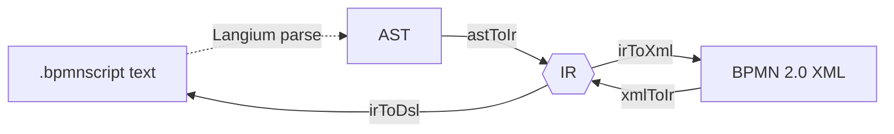

# @bpmn-script/transform

IR type definitions and the four bidirectional transforms that form the core of the BPMNscript pipeline.

## In plain terms

This is the conversion layer — the part that actually moves a process between formats. It's the bulk of the project's original code (the `language` package is mostly generated; this package is hand-written).

Everything pivots on the **IR** (intermediate representation): a small set of plain TypeScript objects, defined in `src/ir/types.ts`, that describe a process without committing to any one file format. Four transforms each convert between the IR and one neighbouring format:



The four solid arrows are this package's transforms; the dotted one (text → AST) is the parser from `@bpmn-script/language`. Routing everything through the IR means each transform only has to understand one conversion, not every pairing. `astToIr` turns the parsed DSL (from the `language` package) into IR; `irToXml` writes deployable BPMN XML and runs auto-layout to add the diagram coordinates; `xmlToIr` reads an existing BPMN file back into IR; `irToDsl` prints IR as `.bpmnscript` text. Compiling is `astToIr` then `irToXml`; decompiling is `xmlToIr` then `irToDsl`.

The IR itself carries no Operaton-specific fields. Engine quirks (the `operaton:` attributes, the 30-day history setting) are attached only inside `irToXml`, so the data model in the middle stays clean.

## Purpose

This package is the transformation layer of BPMNscript. It defines the engine-agnostic Intermediate Representation (IR) that all transforms share, and implements the four functions that convert between IR, BPMN 2.0 XML, and DSL text (see [ADR-0006](../../docs/decisions/0006-engine-agnostic-intermediate-representation.md)).

## IR shape

The IR represents a single executable BPMN process. All types are in `src/ir/types.ts` and re-exported from the package root.

```ts
interface BpmnProcess {
  id: string;
  name?: string;
  isExecutable: true; // always true (executable process)
  flowElements: FlowElement[];
  sequenceFlows: SequenceFlow[];
}

type FlowElement =
  | StartEvent // kind: 'startEvent'
  | EndEvent // kind: 'endEvent'
  | UserTask // kind: 'userTask'  (+assignee?, +formKey?)
  | ServiceTaskJavaClass // kind: 'serviceTask' (+javaClass required)
  | ExclusiveGateway // kind: 'exclusiveGateway' (+defaultFlowId?)
  | ParallelGateway; // kind: 'parallelGateway'

interface SequenceFlow {
  id: string;
  sourceRef: string; // id of source FlowElement
  targetRef: string; // id of target FlowElement
  conditionExpression?: string; // e.g. "${amount > 1000}"
}
```

Operaton-specific values (`operaton:historyTimeToLive = "P30D"`) are applied as constants at XML serialization time and are absent from the IR.

## Public API

```ts
// IR types (re-exported)
import type {
  BpmnProcess,
  FlowElement,
  SequenceFlow,
  StartEvent,
  EndEvent,
  UserTask,
  ServiceTaskJavaClass,
  ExclusiveGateway,
  ParallelGateway,
} from '@bpmn-script/transform';

// Langium AST → IR  (synchronous)
import { astToIr } from '@bpmn-script/transform';
const ir: BpmnProcess = astToIr(langiumAstModel);

// IR → BPMN 2.0 XML string with bpmndi: layout data  (async)
import { irToXml } from '@bpmn-script/transform';
const xml: string = await irToXml(ir);

// BPMN 2.0 XML string → IR  (async; discards DI on import, refuses BPMN
// content the IR cannot express, and warns about non-semantic drops)
import { xmlToIr } from '@bpmn-script/transform';
const { ir, warnings } = await xmlToIr(xmlString);

// IR → .bpmnscript DSL string  (synchronous)
import { irToDsl } from '@bpmn-script/transform';
const dsl: string = irToDsl(ir);

// Deterministic id helpers
import {
  makeGatewaySplitId,
  makeGatewayJoinId,
  makeGatewayForkId,
  makeGatewayLoopId,
  makeDefaultFlowId,
  makeSequenceFlowId,
  makeStartEventId,
  makeEndEventId,
  resolveCollision,
} from '@bpmn-script/transform';

// JUEL expression parser and serializer (import / decompile path)
import {
  parseJuel,
  renderRawFallback,
  renderExprFromIr,
} from '@bpmn-script/transform';
import type {
  JuelNode,
  Accessor,
  BinaryOp,
  ExprResult,
} from '@bpmn-script/transform';

// Error classes
import {
  UnsupportedConstructError,
  UnsupportedElementError,
  UnsupportedServiceTaskFormError,
  UnsupportedEventDefinitionError,
  UnsupportedLoopCharacteristicsError,
  UnsupportedCollaborationError,
} from '@bpmn-script/transform';

// Import-warnings type (non-fatal, non-semantic drops)
import type {
  ImportWarning,
  ImportWarningCategory,
} from '@bpmn-script/transform';
```

### The import contract: refuse or warn, never drop silently

See [ADR-0014](../../docs/decisions/0014-honest-bpmn-import-contract.md) for the rationale.
`xmlToIr` never silently discards content it cannot represent. Content splits into two buckets:

- **Refused** — content the IR cannot express at all. `xmlToIr` throws a subclass of `UnsupportedConstructError` before producing any IR, so there is no partial output.
- **Dropped with a warning** — content the IR does not carry but whose absence causes no semantic loss (an extra Operaton extension attribute, a lane). `xmlToIr` returns it via the `warnings` array instead of throwing.

### Error classes (refusals)

| Class                                 | Thrown by | Reason                                                                                                                                 |
| ------------------------------------- | --------- | -------------------------------------------------------------------------------------------------------------------------------------- |
| `UnsupportedConstructError`           | —         | Abstract base of every refusal below. Catch it to classify any refusal as "unsupported construct" without enumerating subclasses.      |
| `UnsupportedElementError`             | `xmlToIr` | Input XML contains a BPMN element type outside the supported subset (e.g. `bpmn:subProcess`, `bpmn:callActivity`)                      |
| `UnsupportedServiceTaskFormError`     | `xmlToIr` | A service task uses `operaton:expression` or `operaton:delegateExpression` instead of the supported `operaton:class`                   |
| `UnsupportedEventDefinitionError`     | `xmlToIr` | A start/end event carries an event definition (timer, message, signal, error, terminate, …); the IR models only plain start/end events |
| `UnsupportedLoopCharacteristicsError` | `xmlToIr` | A task carries loop characteristics (multi-instance or standard loop); the IR models tasks that run exactly once                       |
| `UnsupportedCollaborationError`       | `xmlToIr` | The document contains a `bpmn:Collaboration` (pools and/or message flows); the IR models a single standalone process                   |

### Import warnings (non-semantic drops)

`xmlToIr` returns `{ ir, warnings }`. Each `ImportWarning` names a construct that was dropped but did not change what the process executes:

```ts
interface ImportWarning {
  elementId: string; // BPMN id of the element the dropped content was attached to
  category: 'extensionAttribute' | 'lane';
  message: string; // names the concrete dropped construct
}
```

- `extensionAttribute` — an Operaton/camunda extension attribute or extension element beyond the supported `assignee`/`formKey`/`class` (e.g. `operaton:asyncBefore`, an `operaton:inputOutput` block). Attribution is exact when moddle ties the content to its owning element; the handful of undeclared `operaton:` elements moddle cannot pin to a specific step are reported once against the process id instead — still never silent, only coarser.
- `lane` — a `bpmn:Lane`; the flat IR has no lane concept, so every step lands in a single process and the lane assignment is dropped.

`warnings` is `[]` for input that round-trips cleanly.

## Build and test

```bash
# From repo root
npm run build --workspace packages/transform
npm test --workspace packages/transform

# From this directory
npm run build
npm test
```

## Source layout

| Path                       | Purpose                                                                                                                                                                                                                                |
| -------------------------- | -------------------------------------------------------------------------------------------------------------------------------------------------------------------------------------------------------------------------------------- |
| `src/ir/types.ts`          | IR type definitions (`BpmnProcess`, `FlowElement`, `SequenceFlow`, …)                                                                                                                                                                  |
| `src/synthesize-ids.ts`    | Deterministic structural id generators (frozen contract; see [ADR-0010](../../docs/decisions/0010-deterministic-structural-ids.md))                                                                                                    |
| `src/ast-to-ir.ts`         | `astToIr`: desugar structured AST → flat IR (gateway synthesis, implicit start/end)                                                                                                                                                    |
| `src/ir-to-xml.ts`         | `irToXml`: IR → BPMN 2.0 XML with Operaton extensions and auto-layout                                                                                                                                                                  |
| `src/xml-to-ir.ts`         | `xmlToIr`: BPMN 2.0 XML → `{ ir, warnings }` (DI discarded, refuses constructs the IR cannot express, warns about non-semantic drops)                                                                                                  |
| `src/cfg-analysis.ts`      | `analyzeCfg`: dominator/post-dominator/back-edge analysis for `irToDsl`                                                                                                                                                                |
| `src/ir-to-dsl.ts`         | `irToDsl`: restructure flat IR → structured DSL text; degrades to `goto` (see [ADR-0009](../../docs/decisions/0009-dominator-based-restructuring.md))                                                                                  |
| `src/juel.ts`              | `parseJuel`, `renderRawFallback`, `renderExprFromIr`: JUEL-subset parser and serializer for the import/decompile path                                                                                                                  |
| `src/errors.ts`            | `UnsupportedConstructError` (base) and its refusal subclasses: `UnsupportedElementError`, `UnsupportedServiceTaskFormError`, `UnsupportedEventDefinitionError`, `UnsupportedLoopCharacteristicsError`, `UnsupportedCollaborationError` |
| `src/index.ts`             | Package barrel export                                                                                                                                                                                                                  |
| `src/operaton-moddle.json` | Trimmed Operaton moddle extension descriptor (see [ADR-0007](../../docs/decisions/0007-operaton-moddle-extension-fork.md))                                                                                                             |

## Key implementation notes

- `irToXml` uses `bpmn-moddle@^10` and `bpmn-auto-layout@^1.2.0`. The layout library injects `<bpmndi:BPMNDiagram>` data automatically; the IR has no coordinate fields.
- The Operaton namespace is applied via `src/operaton-moddle.json`, a trimmed fork of the camunda-bpmn-moddle descriptor. See [ADR-0007](../../docs/decisions/0007-operaton-moddle-extension-fork.md).
- `bpmn-auto-layout@1.x` exposes `layoutProcess(xml)` as a flat named export. The `new BpmnAutoLayout()` constructor pattern belongs to the 0.x series and is not used here.
- `irToDsl` uses dominator/post-dominator analysis from `cfg-analysis.ts` to recognize structured patterns; unmatched edges become `goto`. See [ADR-0009](../../docs/decisions/0009-dominator-based-restructuring.md).
- All synthesized gateway and flow ids come from `synthesize-ids.ts`. The id templates are frozen — changes require updating the round-trip normalizer and regenerating `tests/golden/invoice-approval-generated.bpmn`. See [ADR-0010](../../docs/decisions/0010-deterministic-structural-ids.md).
- `juel.ts` is a hand-rolled recursive-descent parser that mirrors the Langium expression sub-grammar in `bpmn-script.langium`. It is used on the import path (`xmlToIr` reads raw `${…}` bodies; `irToDsl` decides whether to emit native syntax or the quoted fallback).
- `xml-to-ir.ts` refuses (throws) BPMN content the IR cannot express — event definitions on start/end events, loop characteristics, collaborations — before producing any IR, and warns (via the returned `warnings` array) about non-semantic drops such as extra Operaton extension attributes and lanes. See the file's own docstring and "Import warnings" above for the exact contract.

## Dependencies on other packages

- `@bpmn-script/language` (workspace) — provides the Langium-generated AST types consumed by `astToIr` and the `renderExpression` helper.
