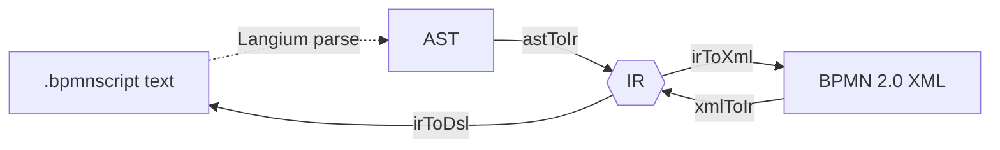

# @bpmn-script/transform

The conversion layer: the IR type definitions and the four transforms that move a process between formats.
It's the bulk of the project's hand-written code, where the `language` package is mostly generated.

Everything pivots on the IR, a small set of plain TypeScript objects in `src/ir/types.ts` that describe a process without committing to any one file format ([ADR-0006](../../docs/decisions/0006-engine-agnostic-intermediate-representation.md)).
Each transform converts between the IR and one neighbouring format, so none of them has to know about any of the others.


```mermaid
flowchart LR
    DSL[".bpmnscript text"]
    AST["AST"]
    IR{{"IR"}}
    XML["BPMN 2.0 XML"]

    DSL -. "Langium parse" .-> AST
    AST -- astToIr --> IR
    IR -- irToDsl --> DSL
    IR -- irToXml --> XML
    XML -- xmlToIr --> IR
```

The four solid arrows are this package; the dotted one is the parser from `@bpmn-script/language`.
`astToIr` turns the parsed DSL into IR, `irToXml` writes deployable BPMN XML and runs auto-layout for the diagram coordinates, `xmlToIr` reads an existing BPMN file back into IR, and `irToDsl` prints IR as `.bpmnscript` text.
Compiling is `astToIr` then `irToXml`; decompiling is `xmlToIr` then `irToDsl`.

The IR carries no Operaton-specific fields.
Engine details (the `operaton:` attributes, the 30-day history setting) are attached inside `irToXml` alone, which keeps the data model in the middle vendor-neutral.

## IR shape

The IR represents one executable BPMN process.
All types live in `src/ir/types.ts` and are re-exported from the package root.

```ts
interface BpmnProcess {
  id: string;
  name?: string;
  isExecutable: true; // always true (executable process)
  flowElements: FlowElement[];
  sequenceFlows: SequenceFlow[];
  errorMessages?: { code: string; message: string }[]; // declared thrown-error message texts, keyed by code
}

type FlowElement =
  | StartEvent // kind: 'startEvent'  (+eventDefinition? on an event-handler start)
  | EndEvent // kind: 'endEvent'  (+eventDefinition? for a typed throw end)
  | UserTask // kind: 'userTask'  (+assignee?, +formKey?)
  | ServiceTask // kind: 'serviceTask' (+binding: class | expression | delegateExpression | external)
  | ScriptTask // kind: 'scriptTask' (+format, +code)
  | ExclusiveGateway // kind: 'exclusiveGateway' (+defaultFlowId?)
  | ParallelGateway // kind: 'parallelGateway'
  | SubProcess // kind: 'subProcess'  (a nested FlowContainer; may host an on-compensation undo block)
  | CallActivity // kind: 'callActivity'  (starts another process; in/out mappings, binding, businessKey)
  | IntermediateThrowEvent // kind: 'intermediateThrowEvent'  (an emit: escalation | signal | compensation)
  | IntermediateCatchEvent // kind: 'intermediateCatchEvent'  (an await: message | timer | signal | conditional)
  | BoundaryEvent; // kind: 'boundaryEvent'  (attached to an activity in the same container; +cancelActivity?: false)

interface SequenceFlow {
  id: string;
  sourceRef: string; // id of source FlowElement
  targetRef: string; // id of target FlowElement
  conditionExpression?: string; // e.g. "${amount > 1000}"
}
```

A `ServiceTask` binds to exactly one execution form, tagged by `binding.kind`: `class` (a Java delegate class, `operaton:class`), `expression`, `delegateExpression` (the DSL spells this one `delegate`), or `external` (`operaton:type="external"` plus `operaton:topic`, written `service X { topic = "..." }`).
The tagged union makes "more than one binding" unrepresentable at the type level and keeps every `switch (binding.kind)` exhaustive.

`SubProcess` is itself a `FlowContainer`, so the IR is recursive: a sub-process nests its own `flowElements` and `sequenceFlows` at any depth, and no sequence flow crosses a container boundary.

Event semantics ride on an `eventDefinition` field, optional on a start or end event and required on an intermediate throw, an intermediate catch, and a boundary event.
Compensation is the odd one out, because BPMN expresses it through `isForCompensation` and an association rather than a boundary event: every holder may carry it except `BoundaryEvent`.
`IntermediateCatchEvent` is restricted to message, signal, timer, or conditional, the four triggers a linear flow can block on and then continue past ([ADR-0020](../../docs/decisions/0020-intermediate-catch-events.md)).
The document-level `bpmn:Error`, `bpmn:Escalation`, `bpmn:Message`, and `bpmn:Signal` roots are derived from usage rather than modeled ([ADR-0016](../../docs/decisions/0016-derived-event-root-elements.md), [ADR-0017](../../docs/decisions/0017-event-trigger-payload-surfaces.md)).

`IntermediateCatchEvent` is a one-in, one-out node on the main flow, the topological twin of `IntermediateThrowEvent` and differing only in whether the token fires forward immediately or waits.
It carries no `name`: there is no body to `goto` back into, so its id is always the synthesized `Catch_<coord>`.

`BoundaryEvent` is the one flow element with outgoing flow but no incoming.
A token appears there directly when its host activity (named by `attachedToRef`, a flow element of the same container) is running and the trigger fires, rather than by traversing a sequence flow into it.
[ADR-0009](../../docs/decisions/0009-dominator-based-restructuring.md) covers how the restructuring analysis treats that second control-flow entry, and [ADR-0019](../../docs/decisions/0019-boundary-events-attached-to-an-activity.md) the rest of the construct.
`cancelActivity` mirrors `StartEvent.isInterrupting` in storing only the non-default `false`, an `alongside` boundary.

## Public API

```ts
import { astToIr, irToXml, xmlToIr, irToDsl } from '@bpmn-script/transform';

const ir: BpmnProcess = astToIr(langiumAstModel); // sync
const xml: string = await irToXml(ir); // async; adds bpmndi: layout data
const { ir, warnings } = await xmlToIr(xmlString); // async; discards DI, may throw
const dsl: string = irToDsl(ir); // sync
```

`src/index.ts` is the full export list: the IR types, the deterministic id helpers, the JUEL parser (`parseJuel`, `renderRawFallback`), the `Unsupported*Error` classes, and the `ImportWarning` types.

## The import contract

`xmlToIr` never discards content without saying so.
What it cannot represent falls into two buckets, and the reasoning is in [ADR-0014](../../docs/decisions/0014-honest-bpmn-import-contract.md).

Content the IR cannot express at all is refused: `xmlToIr` throws a subclass of `UnsupportedConstructError` before producing any IR, so there is no partial output.
Content the IR does not carry but whose absence changes nothing about what the process executes (an extra Operaton extension attribute, a lane) comes back through the `warnings` array instead.

### Refusals

Every class below extends `UnsupportedConstructError`, so catching that one classifies any refusal.
`src/errors.ts` carries the per-class detail and `src/xml-to-ir.ts` the exact conditions.

| Class                                 | Refused because                                                           |
| ------------------------------------- | ------------------------------------------------------------------------- |
| `UnsupportedElementError`             | An element kind outside the supported subset (`bpmn:transaction`, ...)    |
| `UnsupportedServiceTaskFormError`     | A service task with no supported execution binding                        |
| `UnsupportedFormFieldTypeError`       | A form field typed outside `string`/`long`/`boolean`/`date`               |
| `UnsupportedCallActivityError`        | A call activity the engine could not resolve or execute as written        |
| `UnsupportedEventDefinitionError`     | An event definition of the wrong kind for its position                    |
| `UnsupportedEventFeatureError`        | An event of the right kind in a shape the surface cannot express          |
| `UnsupportedLoopCharacteristicsError` | Multi-instance or standard loop characteristics; IR elements run once     |
| `UnsupportedCollaborationError`       | A collaboration, meaning pools or message flows; the IR holds one process |

### Import warnings

`xmlToIr` returns `{ ir, warnings }`, and each `ImportWarning` names something dropped that does not change what the process executes.
`warnings` is `[]` for input that round-trips cleanly.

```ts
interface ImportWarning {
  elementId: string; // BPMN id of the element the dropped content was attached to
  category:
    | 'extensionAttribute'
    | 'lane'
    | 'label'
    | 'unreferencedRoot'
    | 'documentation';
  message: string; // names the concrete dropped construct
}
```

`extensionAttribute` covers an Operaton or camunda extension beyond the supported `assignee`, `formKey`, and `class`, such as `operaton:asyncBefore` or an `operaton:inputOutput` block.
Attribution is exact wherever moddle ties the content to its owning element; the few undeclared `operaton:` elements it cannot pin down are reported once against the process id instead, coarser but still reported.
On a call activity, `variableMappingClass`, `variableMappingDelegateExpression`, and `calledElementTenantId` are execution-affecting rather than cosmetic, so they are refused instead of warned about.

`lane` covers a `bpmn:Lane`.
The flat IR has no lane concept, so every step lands in one process and the assignment goes.

`label` covers a distinct `name` on an event handler, a typed end event, an intermediate throw, an intermediate catch, or a boundary event.
Those read from their trigger and code, so a differing label has nowhere to render.

`unreferencedRoot` covers a `bpmn:Error`, `bpmn:Escalation`, `bpmn:Message`, or `bpmn:Signal` root that no event definition references.

`documentation` covers `bpmn:documentation` on any mapped element, one warning per element.
The IR has no documentation surface, so the text is dropped rather than kept.
Carrying documentation through both transform directions is a real future feature, not yet built.

## Build and test

```bash
# From repo root
npm run build --workspace packages/transform
npm test --workspace packages/transform

# From this directory
npm run build
npm test
```

## Source layout

| Path                       | Purpose                                                                                                                                    |
| -------------------------- | ------------------------------------------------------------------------------------------------------------------------------------------ |
| `src/ir/types.ts`          | IR type definitions (`BpmnProcess`, `FlowElement`, `SequenceFlow`, ...)                                                                    |
| `src/synthesize-ids.ts`    | Deterministic structural id generators; the contract is frozen ([ADR-0010](../../docs/decisions/0010-deterministic-structural-ids.md))     |
| `src/ast-to-ir.ts`         | `astToIr`: desugar the structured AST into flat IR (gateway synthesis, implicit start and end)                                             |
| `src/ir-to-xml.ts`         | `irToXml`: IR to BPMN 2.0 XML with Operaton extensions and auto-layout                                                                     |
| `src/xml-to-ir.ts`         | `xmlToIr`: BPMN 2.0 XML to `{ ir, warnings }`                                                                                              |
| `src/cfg-analysis.ts`      | `analyzeCfg`: dominator, post-dominator, and back-edge analysis for `irToDsl`                                                              |
| `src/ir-to-dsl.ts`         | `irToDsl`: restructure flat IR into DSL text, degrading to `goto` ([ADR-0009](../../docs/decisions/0009-dominator-based-restructuring.md)) |
| `src/juel.ts`              | `parseJuel`, `renderRawFallback`: the JUEL-subset parser and serializer for the import path                                                |
| `src/errors.ts`            | `UnsupportedConstructError` and its refusal subclasses                                                                                     |
| `src/index.ts`             | Package barrel export                                                                                                                      |
| `src/operaton-moddle.json` | Trimmed Operaton moddle extension descriptor ([ADR-0007](../../docs/decisions/0007-operaton-moddle-extension-fork.md))                     |

## Implementation notes

`irToXml` uses `bpmn-moddle@^10` and `bpmn-auto-layout@^1.2.0`.
The layout library injects the `<bpmndi:BPMNDiagram>` data, so the IR needs no coordinate fields.
Version 1.x exposes `layoutProcess(xml)` as a flat named export; the `new BpmnAutoLayout()` constructor belongs to the 0.x series and is not used here.
The Operaton namespace comes from `src/operaton-moddle.json`, a trimmed fork of the camunda-bpmn-moddle descriptor ([ADR-0007](../../docs/decisions/0007-operaton-moddle-extension-fork.md)).

`irToDsl` recognizes structured patterns through the dominator analysis in `cfg-analysis.ts`, and edges that match nothing become `goto` ([ADR-0009](../../docs/decisions/0009-dominator-based-restructuring.md)).

Every synthesized gateway, flow, and boundary-event id comes from `synthesize-ids.ts`.
Gateway and flow ids are positional, derived from the element's structural coordinate.
A boundary event's id is host-derived instead (`Boundary_<hostId>_<trigger>`), so it survives a round trip unmoved no matter where the decompiler places the handler.
The templates are frozen: changing one means updating the round-trip normalizer and regenerating `tests/golden/invoice-approval-generated.bpmn` ([ADR-0010](../../docs/decisions/0010-deterministic-structural-ids.md), [ADR-0019](../../docs/decisions/0019-boundary-events-attached-to-an-activity.md)).

`juel.ts` is a hand-rolled recursive-descent parser mirroring the Langium expression sub-grammar in `bpmn-script.langium`.
It runs on the import path: `xmlToIr` reads raw `${...}` bodies, and `irToDsl` decides between native syntax and the quoted fallback.

## Dependencies on other packages

- `@bpmn-script/language` (workspace) for the Langium-generated AST types `astToIr` consumes, and the `renderExpression` helper
