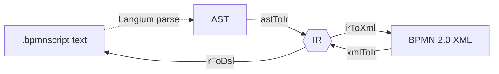

# @bpmn-script/transform

The conversion layer: the IR type definitions and the four transforms that move a process between formats.
It's the bulk of the project's hand-written code, where the `language` package is mostly generated.

Everything pivots on the IR, a small set of plain TypeScript objects in `src/ir/types.ts` that describe a process without committing to any one file format ([ADR-0006](../../docs/decisions/0006-engine-agnostic-intermediate-representation.md)).
Each transform converts between the IR and one neighboring format, so none of them has to know about any of the others.


```mermaid
flowchart LR
    DSL[".bpmnscript text"]
    AST["AST"]
    IR{{"IR"}}
    XML["BPMN 2.0 XML"]

    DSL -. "Langium parse" .-> AST
    AST -- astToIr --> IR
    IR -- irToDsl --> DSL
    IR -- irToXml --> XML
    XML -- xmlToIr --> IR
```

The four solid arrows are this package; the dotted one is the parser from `@bpmn-script/language`.
`astToIr` turns the parsed DSL into IR, `irToXml` writes deployable BPMN XML and runs auto-layout for the diagram coordinates, `xmlToIr` reads an existing BPMN file back into IR, and `irToDsl` prints IR as `.bpmnscript` text.
Compiling is `astToIr` then `irToXml`; decompiling is `xmlToIr` then `irToDsl`.

The IR names the engine settings it carries without a vendor prefix, and the `operaton:` prefix itself is applied inside `irToXml` alone.
Details the IR does not model at all, such as the process's `targetNamespace`, are attached there too.

## IR shape

The IR represents one executable BPMN process.
All types live in `src/ir/types.ts` and are re-exported from the package root.

```ts
interface BpmnProcess {
  id: string;
  name?: string;
  documentation?: string; // bpmn:documentation, carried verbatim from a single plaintext child
  isExecutable: true; // always true (executable process)
  versionTag?: string; // operaton:versionTag, an author-supplied version label
  historyTimeToLive?: string; // operaton:historyTimeToLive, absent means the exporter's default (P30D)
  candidateStarterUsers?: string; // operaton:candidateStarterUsers, a comma-separated list of user ids
  candidateStarterGroups?: string; // operaton:candidateStarterGroups, a comma-separated list of group ids
  flowElements: FlowElement[];
  sequenceFlows: SequenceFlow[];
  errorDecls?: { name: string; code: string; message?: string }[]; // every error code the process raises, catches, or declares
  escalationDecls?: { name: string; code: string }[]; // the same for escalation codes; BPMN gives an escalation no message
}

type FlowElement =
  | StartEvent // kind: 'startEvent'  (+eventDefinition? on a process's own start with a trigger, or on an event-handler start, +initiator?, +formFields?)
  | EndEvent // kind: 'endEvent'  (+eventDefinition? for a typed throw end, a terminate, or a cancel)
  | UserTask // kind: 'userTask'  (+assignee?, +formKey?, +formRef?: a deployed form's key and the binding resolving it, +formFields?, +candidateGroups?/candidateUsers?/dueDate?/followUpDate?/priority?, +loop?)
  | ServiceTask // kind: 'serviceTask' (+binding: class | expression | delegateExpression | external | decision, the first and third also carrying +fields?: the name and value pairs the engine sets on the bean, the external one +taskPriority?/properties?/errorMappings?, +resultVariable?, +element?: send | businessRule, the tag it serializes to, +loop?)
  | ScriptTask // kind: 'scriptTask' (+format, +code, +resultVariable?, +loop?)
  | Task // kind: 'task'  (no binding of its own; the engine records it and passes straight through; +loop?)
  | ReceiveTask // kind: 'receiveTask'  (+messageName?: absent waits for the engine's own signal API instead of a correlation, +loop?)
  | ExclusiveGateway // kind: 'exclusiveGateway' (+defaultFlowId?)
  | ParallelGateway // kind: 'parallelGateway'
  | InclusiveGateway // kind: 'inclusiveGateway' (+defaultFlowId?)
  | EventBasedGateway // kind: 'eventBasedGateway'
  | SubProcess // kind: 'subProcess'  (a nested FlowContainer; may host an on-compensation undo block; +element?: 'transaction', the tag it serializes to; +loop?)
  | CallActivity // kind: 'callActivity'  (starts another process; in/out mappings, binding, businessKey, +mapper?: the class or bean that computes the mapping in code, +loop?)
  | IntermediateThrowEvent // kind: 'intermediateThrowEvent'  (an emit: escalation | message | signal | compensation | link; +binding? on a message, the implementation Operaton sends it with)
  | IntermediateCatchEvent // kind: 'intermediateCatchEvent'  (an await: message | timer | signal | conditional | link)
  | BoundaryEvent; // kind: 'boundaryEvent'  (attached to an activity in the same container; +cancelActivity?: false)

interface SequenceFlow {
  id: string;
  sourceRef: string; // id of source FlowElement
  targetRef: string; // id of target FlowElement
  conditionExpression?: string; // e.g. "${amount > 1000}"
}
```

Every event and activity kind above also carries the flat engine settings Operaton reads off a flow node: `asyncBefore`, `asyncAfter`, `exclusive`, `jobPriority`, and `retryCycle` (the `operaton:failedJobRetryTimeCycle` element body), plus `executionListeners`.
Only non-default values are stored, so `asyncBefore` and `asyncAfter` are `true` or absent and `exclusive` is `false` or absent.
Every gateway kind carries none of them: an `if`, `while`, `do...while`, `parallel`, or a multi-branch `await` synthesizes its gateways as structural coordinates with no textual identity, so there is nowhere to author an engine setting for one ([ADR-0022](../../docs/decisions/0022-engine-attributes-as-named-ir-fields.md)).
A `StartEvent` and a `UserTask` also carry `formFields`, the `operaton:formData` block: a `FormField` has a type (`string`, `number`, `boolean`, `date`, or `enum`), a label, a default, the `datePattern` a date is parsed with, an enum's `values`, its `constraints` in the order the engine validates them, each a name from the closed `FormConstraintName` union and a `config`, and its `properties`, the `operaton:property` entries ([ADR-0037](../../docs/decisions/0037-form-field-constraints-values-and-properties.md)).

The seven activity kinds additionally carry `inputParameters` and `outputParameters`, the `operaton:inputOutput` block in declaration order.
An `IoParameter` is a name and one `IoValue`, tagged `text`, `script`, `list`, or `map`, so a value carrying two forms at once is unrepresentable rather than checked at runtime.
The same seven carry an optional `loop`, a `LoopCharacteristics` holding the `cardinality`, the `collection` and the `elementVariable` each run binds from it, a `completionCondition`, and `sequential`, which is `true` or absent because the engine runs the instances at once by default.
A `UserTask` also carries `taskListeners`, whose events are the six points of a task's human lifecycle; `timeout` is the one that carries a timer.
An `ExecutionListener` and a `TaskListener` carry exactly one binding, tagged `class`, `expression`, `delegateExpression`, or `script`, the first three being the same three a service task binds by and the fourth an inline script where a service task has the external topic.

A `ServiceTask` binds to exactly one execution form, tagged by `binding.kind`: `class` (a Java delegate class, `operaton:class`), `expression`, `delegateExpression` (the DSL spells this one `delegate`), `external` (`operaton:type="external"` plus `operaton:topic`, written `service X(topic: "...")`), or `decision` (`operaton:decisionRef` plus the shared version pinning and `mapDecisionResult`, legal only when `element` is `businessRule`).
The external variant alone carries `taskPriority` (`operaton:taskPriority`, an integer or an expression), `properties` (an `operaton:properties` block keyed by `name`), and `errorMappings`, each an `ErrorMapping` of the `errorCode` a `bpmn:error` root is derived for and the `condition` an `operaton:errorEventDefinition` evaluates, since `BpmnParse.parseExternalServiceTask` reads the three and no other binding reaches it ([ADR-0038](../../docs/decisions/0038-external-task-extras-ride-the-topic-binding.md)).
`element` picks which of the three tags this node serializes to: absent for `bpmn:serviceTask`, `'send'` for `bpmn:sendTask`, `'businessRule'` for `bpmn:businessRuleTask`.
The tagged union makes "more than one binding" unrepresentable at the type level and keeps every `switch (binding.kind)` exhaustive.
A document naming more than one is resolved the way Operaton resolves it: `operaton:type` outranks the code attributes, then `class`, then `delegateExpression`, then `expression`, and on a business rule task an `operaton:decisionRef` outranks all of them.
A `type` this surface cannot carry therefore refuses the document rather than falling back to a code attribute the engine would never reach, and whatever the winner shadows is dropped with a warning naming it.

`SubProcess` is itself a `FlowContainer`, so the IR is recursive: a sub-process nests its own `flowElements` and `sequenceFlows` at any depth, and no sequence flow crosses a container boundary.
`element` picks which of the two tags it serializes to, absent for `bpmn:subProcess` and `'transaction'` for `bpmn:transaction`, which the DSL writes with the `attempt` head.
Operaton runs the second tag through the very behavior class it gives the first, so the tag changes nothing about how the block executes; what it buys is that the engine then accepts a cancel end inside the block and a cancel boundary on it, and refuses to deploy either anywhere else.

Event semantics ride on an `eventDefinition` field, optional on a start or end event and required on an intermediate throw, an intermediate catch, and a boundary event.
`terminate` and `cancel` join the union on an end event alone and are both payload-free: one stops every running path of its scope at once and the other gives up the block the end sits in.
Neither raises anything for a handler to catch by name, which is why the surface spells both on `end` instead of `throw`.
Compensation is the odd one out, because BPMN expresses it through `isForCompensation` and an association rather than a boundary event: every holder may carry it except `BoundaryEvent`.
`IntermediateCatchEvent` is restricted to message, signal, timer, condition, or link: the first four are the triggers a linear flow can block on and then continue past ([ADR-0020](../../docs/decisions/0020-intermediate-catch-events.md)), and link is the catching end of a pair added for the import direction ([ADR-0035](../../docs/decisions/0035-link-events-for-import-round-trip-symmetry.md)).
The document-level `bpmn:Error`, `bpmn:Escalation`, `bpmn:Message`, and `bpmn:Signal` roots are synthesized rather than modeled ([ADR-0016](../../docs/decisions/0016-derived-event-root-elements.md), [ADR-0017](../../docs/decisions/0017-event-trigger-payload-surfaces.md)).
A message or signal root comes from the names in use, an error or escalation root from the codes in use together with `errorDecls` and `escalationDecls`, which is where a declared root's `name` and message text live.

`IntermediateCatchEvent` is a one-in, one-out node on the main flow, the topological twin of `IntermediateThrowEvent` and differing only in whether the token fires forward immediately or waits.
A link pair is the one exception: no flow leaves a link throw and none enters a link catch, and both carry `linkName`, the one fact that pairs them, since the engine matches the two ends by name in a table it keeps per deployed file.
The catch's id is the synthesized `Catch_<coord>` unless the `await` carries a name, which is what lets an imported catch keep the id it came with.

A token appears at a `BoundaryEvent` while its host activity (named by `attachedToRef`, a flow element of the same container) is running, entering from the host when the trigger fires rather than by traversing a sequence flow into it.
[ADR-0009](../../docs/decisions/0009-dominator-based-restructuring.md) covers how the restructuring analysis treats that second control-flow entry, and [ADR-0019](../../docs/decisions/0019-boundary-events-attached-to-an-activity.md) the rest of the construct.
`cancelActivity` mirrors `StartEvent.isInterrupting` in storing only the non-default `false`, an `alongside` boundary.

## Public API

```ts
import { astToIr, irToXml, xmlToIr, irToDsl } from '@bpmn-script/transform';

const ir: BpmnProcess = astToIr(langiumAstModel); // sync
const xml: string = await irToXml(ir); // async; adds bpmndi: layout data
const { ir: imported, warnings } = await xmlToIr(xmlString); // async; discards DI, may throw
const { source, warnings: printWarnings } = irToDsl(ir); // sync; warns for what it cannot carry into the script
```

`src/index.ts` is the public surface, summarized here: the IR types, `isGateway` and `gatewayDefaultFlowId` for reading them at runtime, the deterministic id helpers, the JUEL parser (`parseJuel`, `renderRawFallback`), the `Unsupported*Error` classes, and the `ImportWarning` and `PrintWarning` types.

## The import contract

`xmlToIr` never discards an element without saying so.
What it cannot represent falls into two buckets, and the reasoning is in [ADR-0014](../../docs/decisions/0014-honest-bpmn-import-contract.md).

Content the IR cannot express at all is refused: `xmlToIr` throws a subclass of `UnsupportedConstructError` before producing any IR, so there is no partial output.
Content the IR does not carry (an extra Operaton extension attribute, a lane, a text annotation) comes back through the `warnings` array instead.

The diagram interchange data aside ([ADR-0003](../../docs/decisions/0003-auto-layout-for-diagram-interchange.md)), no element is dropped in silence.
Every BPMN element and every extension element `xmlToIr` cannot carry is reported, named by the tag the document spells and by its own id, and attributed to the element it sat on.
A construct is reported whole, so a dropped `bpmn:ioSpecification` names itself rather than each data input inside it.
The lane structure goes the same way, reported lane by lane, with anything hung on a lane or a lane set leaving with it.

`camunda:` is not a foreign namespace here.
`xmlToIr` reads a `camunda:` extension attribute under its local name the way Operaton does, so `camunda:assignee` imports exactly as `operaton:assignee` does and `camunda:formHandlerClass` drops exactly as `operaton:formHandlerClass` does.
The alias covers attributes only, so a `camunda:` extension element drops whole, except for a connector, which is refused under either prefix wherever it sits: beside a service, send, or business rule task's implementation, and on a thrown message.

What is dropped without a warning is an attribute `xmlToIr` does not read, and it comes in two shapes.
One is an attribute in a foreign namespace written directly on a mapped BPMN element, which is where an editor parks its own bookkeeping.
The same attribute on an Operaton extension element the IR reads is reported, a whole foreign-namespace extension element is reported too, and an attribute written in no namespace at all that BPMN does not declare is reported as well, since no editor writes there.
The other is a BPMN attribute this surface neither reads nor reports: a sequence flow's `name`, or a process's `processType` or `isClosed`.
Each of those is content left out.
A lone `operaton:resource` on a sequence flow's condition expression or a conditional event definition's condition is the one exception that is reported rather than silently dropped: Operaton reads it only alongside a `language`, so on its own it reaches nothing, and the condition still imports as the expression its body writes.
`isExecutable="false"`, whose import changes what the document says, is reported instead of left for the reader to notice.

### Refusals

Every class below extends `UnsupportedConstructError`, so catching that one classifies any refusal.
`src/errors.ts` carries the per-class detail and `src/xml-to-ir.ts` the exact conditions.

| Class                                 | Refused because                                                                                                                                                                                                                                                                                                                                                                                                                                                                                                                                                                                                                                                                                                                                                                                                                                                                                                                                                                                                                                                                                                                                                                                                                                                                                                                                                                                                                                                                                                                                        |
| ------------------------------------- | ------------------------------------------------------------------------------------------------------------------------------------------------------------------------------------------------------------------------------------------------------------------------------------------------------------------------------------------------------------------------------------------------------------------------------------------------------------------------------------------------------------------------------------------------------------------------------------------------------------------------------------------------------------------------------------------------------------------------------------------------------------------------------------------------------------------------------------------------------------------------------------------------------------------------------------------------------------------------------------------------------------------------------------------------------------------------------------------------------------------------------------------------------------------------------------------------------------------------------------------------------------------------------------------------------------------------------------------------------------------------------------------------------------------------------------------------------------------------------------------------------------------------------------------------------ |
| `UnsupportedElementError`             | An element kind outside the supported subset (`bpmn:adHocSubProcess`, `bpmn:complexGateway`, ...)                                                                                                                                                                                                                                                                                                                                                                                                                                                                                                                                                                                                                                                                                                                                                                                                                                                                                                                                                                                                                                                                                                                                                                                                                                                                                                                                                                                                                                                      |
| `UnsupportedServiceTaskFormError`     | A service, send, or business rule task that carries no execution binding the engine would reach, that carries an `operaton:type` this surface cannot carry, or that carries an `<operaton:connector>` element beside its implementation attributes, which the Connect plugin runs in their place; or a thrown message whose binding shape it cannot read                                                                                                                                                                                                                                                                                                                                                                                                                                                                                                                                                                                                                                                                                                                                                                                                                                                                                                                                                                                                                                                                                                                                                                                               |
| `UnsupportedFormFieldTypeError`       | A form field typed outside `string`/`long`/`boolean`/`date`/`enum`                                                                                                                                                                                                                                                                                                                                                                                                                                                                                                                                                                                                                                                                                                                                                                                                                                                                                                                                                                                                                                                                                                                                                                                                                                                                                                                                                                                                                                                                                     |
| `UnsupportedFormFieldConstraintError` | A form field constraint the engine refuses to deploy or the script cannot spell: a name outside the seven the surface takes, since `FormValidators.createValidator` fails the deployment on any name it has not registered, a `validator` or a bound with no `config`, or a name repeated on one field                                                                                                                                                                                                                                                                                                                                                                                                                                                                                                                                                                                                                                                                                                                                                                                                                                                                                                                                                                                                                                                                                                                                                                                                                                                 |
| `UnsupportedFormReferenceError`       | A user task naming both a form key and a form reference, or a form reference with no binding or one outside `latest`, `deployment`, and `version`                                                                                                                                                                                                                                                                                                                                                                                                                                                                                                                                                                                                                                                                                                                                                                                                                                                                                                                                                                                                                                                                                                                                                                                                                                                                                                                                                                                                      |
| `UnsupportedCallActivityError`        | A call activity the engine could not resolve or execute as written                                                                                                                                                                                                                                                                                                                                                                                                                                                                                                                                                                                                                                                                                                                                                                                                                                                                                                                                                                                                                                                                                                                                                                                                                                                                                                                                                                                                                                                                                     |
| `UnsupportedEventDefinitionError`     | An event definition of the wrong kind for its position                                                                                                                                                                                                                                                                                                                                                                                                                                                                                                                                                                                                                                                                                                                                                                                                                                                                                                                                                                                                                                                                                                                                                                                                                                                                                                                                                                                                                                                                                                 |
| `UnsupportedEventFeatureError`        | An event of the right kind in a shape the surface cannot express, such as a process start carrying an error, escalation, or compensation trigger, a message start whose name is an expression, a second start event in a subprocess or transaction, or a thrown message carrying a connector element. Also a compensation boundary event, or an `isForCompensation` activity, since BPMN attaches compensation through a boundary event and an association rather than the `subprocess`/`on compensation` block this surface writes; when the two pair up through a `bpmn:association`, the message names the compensated activity, the boundary event, and the handler, and prints the `subprocess`/`on compensation` rewrite to write by hand. Also a cancel definition where Operaton refuses to deploy one: on an end event outside a `bpmn:transaction`, on a boundary event whose host is not one, or on a second cancel boundary of the same block. Also a cancel boundary carrying `cancelActivity="false"`, which Operaton deploys and lets run beside the block instead of in place of it, a shape this surface has no spelling for. Also a branch of a wait with several branches that leads to anything other than another wait, and a branch-opening wait that another path also flows into. Also a link definition naming no link, and a sequence flow leaving a link throw or entering a link catch, a branch of a wait included: a throw ends its path and a catch is entered by the throw of its name, so neither flow has a spelling |
| `UnsupportedLoopCharacteristicsError` | A multi-instance repetition on an event handler, which its trigger enters rather than repeats, or a multi-instance repetition anywhere in a shape this surface cannot write back: an async or retry setting on the repetition element itself, an `operaton:outputParameter` beside it, a `bpmn:loopCardinality` body or an element name it cannot spell, or a combination Operaton refuses to deploy                                                                                                                                                                                                                                                                                                                                                                                                                                                                                                                                                                                                                                                                                                                                                                                                                                                                                                                                                                                                                                                                                                                                                   |
| `UnsupportedCollaborationError`       | A collaboration, meaning pools or message flows; the IR holds one process                                                                                                                                                                                                                                                                                                                                                                                                                                                                                                                                                                                                                                                                                                                                                                                                                                                                                                                                                                                                                                                                                                                                                                                                                                                                                                                                                                                                                                                                              |
| `UnsupportedExtensionFormError`       | An input/output value or a listener in a shape this surface cannot write, a script task naming a deployment resource, which runs in place of its body, or an injected field naming no value slot or both of its literal ones, neither of which Operaton deploys                                                                                                                                                                                                                                                                                                                                                                                                                                                                                                                                                                                                                                                                                                                                                                                                                                                                                                                                                                                                                                                                                                                                                                                                                                                                                        |
| `UnsupportedErrorMappingError`        | An `operaton:errorEventDefinition` on an external task carrying `errorRef` and no `expression`, which `parseOperatonErrorEventDefinitions` fails the deployment on, or an `errorRef` naming no error root or one with no code, the refusal a throw's dangling reference draws; moddle deletes an unresolved reference, so a definition written with no `errorRef`, which the engine skips, arrives the same way                                                                                                                                                                                                                                                                                                                                                                                                                                                                                                                                                                                                                                                                                                                                                                                                                                                                                                                                                                                                                                                                                                                                        |
| `UnsupportedAssignmentError`          | A user task carrying a `bpmn:humanPerformer` beside `operaton:assignee`, which `parseUserTaskCustomExtensions` refuses as a duplicate assignee, or more than one `bpmn:humanPerformer`, which `parseHumanPerformer` refuses                                                                                                                                                                                                                                                                                                                                                                                                                                                                                                                                                                                                                                                                                                                                                                                                                                                                                                                                                                                                                                                                                                                                                                                                                                                                                                                            |
| `UnsupportedConditionExpressionError` | A sequence flow's condition or a conditional event definition's condition carrying a `language`, which Operaton evaluates in a script engine rather than as the UEL expression this tool writes                                                                                                                                                                                                                                                                                                                                                                                                                                                                                                                                                                                                                                                                                                                                                                                                                                                                                                                                                                                                                                                                                                                                                                                                                                                                                                                                                        |

### Import warnings

`xmlToIr` returns `{ ir, warnings }`, and each `ImportWarning` names one construct the import dropped or changed, or one it carried whole that the engine will not run as written.
`warnings` is `[]` for input that round-trips cleanly.

```ts
interface ImportWarning {
  elementId: string; // BPMN id of the element the dropped content was attached to
  category:
    | 'extensionAttribute'
    | 'lane'
    | 'label'
    | 'unreferencedRoot'
    | 'documentation'
    | 'unmappedConstruct';
  message: string; // names the concrete construct
}
```

`extensionAttribute` covers an Operaton or camunda extension the IR does not read off the element carrying it: an `operaton:` element the moddle extension does not declare, a foreign vendor namespace, and an attribute with no IR field at all such as `operaton:formHandlerClass`.
An injected field drops the same way in two shapes: one riding a binding other than `class` or `delegate`, since Operaton hands no field list to any other, and one whose stored value disagrees with the `${` prefix that decides whether it is written back as a literal or as an expression.
An `operaton:string` child is carried rather than dropped: its text lands on the field the same way a `stringValue` attribute's would, and the warning names only that this tool writes it back as a `stringValue` attribute on export.
The question is asked per owner kind, so an engine setting on a gateway, an `operaton:formData` on a service task, and an `operaton:inputOutput` on an event are reported too: no IR node reads them there.
It is asked again of every extension child the IR does read, so an unread attribute there is reported rather than leaving with the element that imports: an `operaton:taskListener`'s `id`, which Operaton addresses a timeout listener's job by, an undeclared `operaton:` or foreign-namespace attribute on a listener or an input/output parameter, and the `id`/`name` decoration on an `operaton:value` list item.
The same `operaton:value` tag on a form field is an enum value the IR reads, `id` and `name` included.
A form field drops three things the engine never reads, each warning naming the method that ignores it: a `datePattern` off a `date` field, `operaton:value` children off an `enum` field, and a `config` on a `required` or `readonly` constraint.
Three more are carried as written, with a warning that the printed script draws an error at the field, since the engine deploys each and dropping it would change what runs: a bound on a type its validator refuses, a bound whose `config` is not an integer, and a literal enum default naming none of the values.
A repeated enum value id is rewritten the way `FormTypes.parseFormPropertyType` keeps it, once at its first position with its last `name`, and the warning names the rewrite.
An external task's `operaton:taskPriority`, `operaton:properties`, or `operaton:errorEventDefinition` on a service, send, or business rule task bound by class, expression, delegate expression, or decision is reported here too, one warning per item, since `parseExternalServiceTask` alone reads them and the step runs without them either way.
The `errorCodeVariable` and `errorMessageVariable` on such a definition warn as they do on a thrown error: the engine stores them and reads them off the catching definition alone.
A task's `operaton:property` is keyed by `name`, as `BpmnParseUtil.parseOperatonExtensionProperties` reads it, and a form field's by `id`, as `DefaultFormHandler.parseProperties` reads it, so each side reports the other attribute as unread; an entry missing its key or its value is skipped with a warning, and a repeated key is kept once at its first position with its last value, as both readers keep it.
A second `operaton:inputOutput`, `operaton:formData`, `operaton:properties`, or `operaton:failedJobRetryTimeCycle` on one element is reported here as well, since Operaton reads one of each and the first is kept.
A repetition naming its collection or its element variable in both the BPMN and the `operaton:` spelling goes the same way, since the BPMN spelling is the one Operaton keeps and the `operaton:` one is dropped.
An implementation attribute that a higher-ranked one shadows is reported here too, on a service, send, or business rule task, on a thrown message, and on a call activity naming both of its variable-mapping attributes, since Operaton never reads past the binding it resolves.
An engine setting or a listener on a link throw is reported here as well, one warning per item: Operaton creates no activity for a link throw and so never reads them, and the re-exported document runs the same without them.
Attribution is exact wherever moddle ties the content to its owning element; the few undeclared `operaton:` elements it cannot pin down are reported once against the process id instead, coarser but still reported.
On a call activity, `calledElementTenantId` is execution-affecting rather than cosmetic, so it is refused instead of warned about: it pins which tenant the engine resolves the called process against, so dropping it changes which process runs.
Neither variable-mapping attribute falls on that side of the boundary, since Operaton runs a mapping delegate after the declared `in` and `out` mappings rather than in place of them, so both import into the IR's `mapper` field instead ([ADR-0033](../../docs/decisions/0033-call-activity-variable-mapping.md)).
An input/output value or a listener the surface cannot write is refused for the same reason: dropping a value form, a second listener firing at the same event, or a second parameter binding the same name would change what the process runs.

`lane` covers a `bpmn:Lane`, one warning per lane, a lane nested in a `bpmn:childLaneSet` included.
The flat IR has no lane concept, so every step lands in one process and the assignment goes.

`label` covers a distinct `name` on an event handler, a typed end event, an intermediate throw, an intermediate catch, or a boundary event.
Those read from their trigger and code, so a differing label has nowhere to render.
A link event's `name` is written from its link name on export, so a `name` equal to the link name is derived and a differing one alone is reported.
It also covers a label on a start or an end whose id carries a synthesized-id prefix, since a script cannot spell that id back: the statement that would have carried the label is left out whole for a start, and for an end only at its block's tail; elsewhere the end prints under its reserved id and the print reports it.

`unreferencedRoot` covers a `bpmn:Message` or `bpmn:Signal` root that nothing in the process references, a receive task's `messageRef` included.
It also covers an error or escalation root carrying no code, which nothing can key it by; one carrying a code imports as a declaration whether or not anything raises it.

`documentation` covers `bpmn:documentation` at every position where `label` above is warned, for the same reason: an event handler, a typed end event, an intermediate throw, an intermediate catch, a boundary event, and a start or an end whose id carries a synthesized-id prefix.
It also covers a `bpmn:documentation` on a position that reads no `name` at all: the definitions root, an event definition, an external task's `operaton:errorEventDefinition`, an Error/Escalation/Message/Signal root, a multi-instance loop characteristics element, and a sequence flow.
A second `bpmn:documentation` child on one element, or one whose `textFormat` is set to anything but plaintext, falls under the category regardless of position.
Everywhere else the text is carried onto the IR node alongside its `name` ([ADR-0031](../../docs/decisions/0031-carry-bpmn-documentation.md)).

`unmappedConstruct` covers BPMN content no reader on this transform reads, one warning per construct.
On an element it touches: an artifact on a process or sub-process (a `bpmn:textAnnotation`, its `bpmn:association`, a `bpmn:group`), a `bpmn:ioSpecification`, a `bpmn:property`, a data association, a `bpmn:auditing` or `bpmn:monitoring` block, and a resource role the engine reads nothing of.
On a user task a `bpmn:humanPerformer` and a `bpmn:potentialOwner` are read instead, the way `BpmnParse.parseTaskDefinition` reads them: the performer's formal expression is the assignee, each owner's is split as `parseCommaSeparatedList` splits it into `user(x)` candidate users and `group(x)` or bare candidate groups, and the role-derived entries come before the `operaton:` attribute's own, in the engine's order.
One warning per role names the rewrite, since the script writes `assignee`, `candidateUsers`, and `candidateGroups` and the exported document carries the Operaton attributes alone; the engine builds the same identity links from either spelling ([ADR-0039](../../docs/decisions/0039-import-bpmn-resource-assignment-and-report-the-quantity-attributes.md)).
What the engine reads nothing of stays a drop: a `bpmn:performer` or a bare `bpmn:resourceRole`, a role with no `bpmn:formalExpression` child (a `bpmn:expression` typed `tFormalExpression` through `xsi:type` included, since the engine fetches the child by tag), a role's `resourceRef` or parameter binding, and any role on an activity other than a user task.
A `startQuantity` or `completionQuantity` other than `1` on an activity is reported here too: BPMN declares both with a default of `1` and `BpmnParse` never reads either, so the step runs as if it read `1`, which is what the source document runs.
On a repetition: the `bpmn:loopDataOutputRef`, `bpmn:oneBehaviorEventRef`, and `bpmn:noneBehaviorEventRef` references and a `behavior` other than `All`, all of which Operaton parses and then never reads.
An `operaton:jobPriority` there joins them, since Operaton reads a job priority off the step and never off the repetition element.
A `bpmn:standardLoopCharacteristics`, with its `bpmn:loopCondition` child, drops whole rather than importing as a repetition: Operaton's own parser looks only for a multi-instance child there, so the activity deploys through its ordinary path and runs once regardless of what the source declared.
As a flow element in its own right: a `bpmn:dataObject` (with anything nested under it, such as a `bpmn:dataState`), a `bpmn:dataObjectReference`, or a `bpmn:dataStoreReference`, at process level and inside a sub-process alike; none of the three is something a `bpmn:sequenceFlow` can point at, so dropping it leaves no hole in the graph, and Operaton keeps process variables in its own store regardless.
Beside the process: a root element other than the error, escalation, message, and signal roots the events resolve against, such as a `bpmn:category`, a `bpmn:dataStore`, a `bpmn:itemDefinition`, or a `bpmn:interface`.
On a `bpmn:transaction`: the `method` and `protocol` attributes, which Operaton never reads, and `triggeredByEvent="true"`, which it ignores on that tag and runs the block as an ordinary step of the surrounding flow.
On a wait with several branches: an `instantiate="true"`, and an `eventGatewayType` other than `Exclusive`, neither of which Operaton's own parser ever reads.
On any step: a `default`, which names the route Operaton takes when no other route out of the step is taken, and which this surface carries on a split alone, so the imported step is left with no route to fall back on.
The category also covers an attribute written without a namespace that BPMN does not declare, attributed to the element carrying it.
Three members of the category report a changed value rather than a dropped construct.
One is an expression body opening with the `#{...}` delimiter, on a `bpmn:loopCardinality`, a `bpmn:completionCondition`, a `bpmn:conditionExpression`, or a `bpmn:condition`: this surface writes `${...}` only, so the body comes back inside that delimiter, which Operaton evaluates identically.
A `#{` later in the body is left alone, since the printer returns such a body character for character.
The second is `isExecutable="false"` on the process: the IR holds an executable process and nothing else, so the import and the file written back from it are both executable and an engine will run what the source document held back.
An absent `isExecutable` needs no warning, an engine reading that as executable too.
The third is a `bpmn:manualTask`, imported through the same mapper as `bpmn:task`: `ManualTaskActivityBehavior` and `TaskActivityBehavior` differ in nothing Operaton reads, so token flow, waiting, listeners, async, and job configuration are unchanged, but `HistoricActivityInstance.getActivityType()` reports `task` where the source wrote `manualTask`, and the warning names that rewrite.

Two more members report neither a drop nor a change, but a construct that arrived half-written.
A cancel end and the cancel boundary event that catches it are wired together when Operaton parses the boundary, and nothing but such an end ever reaches such a boundary, so either half alone deploys and then goes wrong at run time.
A block holding a cancel end with no cancel boundary attached imports whole, and the warning names the error the engine stops with the first time that end is reached.
A cancel boundary on a block nothing inside gives up imports whole too, and the warning names the path that can never run.
Refusing either would reject a file the engine deploys, which the import contract does not license.

## Build and test

```bash
# From repo root
npm run build --workspace packages/transform
npm test --workspace packages/transform

# From this directory
npm run build
npm test
```

## Source layout

| Path                       | Purpose                                                                                                                                                  |
| -------------------------- | -------------------------------------------------------------------------------------------------------------------------------------------------------- |
| `src/ir/types.ts`          | IR type definitions (`BpmnProcess`, `FlowElement`, `SequenceFlow`, ...)                                                                                  |
| `src/synthesize-ids.ts`    | Deterministic structural id generators; the contract is frozen ([ADR-0010](../../docs/decisions/0010-deterministic-structural-ids.md))                   |
| `src/ast-to-ir.ts`         | `astToIr`: desugar the structured AST into flat IR (gateway synthesis, implicit start and end)                                                           |
| `src/ir-to-xml.ts`         | `irToXml`: IR to BPMN 2.0 XML with Operaton extensions and auto-layout                                                                                   |
| `src/xml-to-ir.ts`         | `xmlToIr`: BPMN 2.0 XML to `{ ir, warnings }`                                                                                                            |
| `src/cfg-analysis.ts`      | `analyzeCfg`: dominator, post-dominator, and back-edge analysis for `irToDsl`                                                                            |
| `src/ir-to-dsl.ts`         | `irToDsl`: restructure flat IR into `{ source, warnings }`, degrading to `goto` ([ADR-0009](../../docs/decisions/0009-dominator-based-restructuring.md)) |
| `src/juel.ts`              | `parseJuel`, `renderRawFallback`: the JUEL-subset parser and serializer for the import path                                                              |
| `src/errors.ts`            | `UnsupportedConstructError` and its refusal subclasses                                                                                                   |
| `src/index.ts`             | Package barrel export                                                                                                                                    |
| `src/operaton-moddle.json` | Trimmed Operaton moddle extension descriptor ([ADR-0007](../../docs/decisions/0007-operaton-moddle-extension-fork.md))                                   |

## Implementation notes

`irToXml` uses `bpmn-moddle@^10` and `bpmn-auto-layout@^1.2.0`.
The layout library injects the `<bpmndi:BPMNDiagram>` data, so the IR needs no coordinate fields.
Version 1.x exposes `layoutProcess(xml)` as a flat named export; the `new BpmnAutoLayout()` constructor belongs to the 0.x series and is not used here.
The Operaton namespace comes from `src/operaton-moddle.json`, a trimmed fork of the camunda-bpmn-moddle descriptor ([ADR-0007](../../docs/decisions/0007-operaton-moddle-extension-fork.md)).

`irToDsl` recognizes structured patterns through the dominator analysis in `cfg-analysis.ts`, and edges that match nothing become `goto` ([ADR-0009](../../docs/decisions/0009-dominator-based-restructuring.md)).

Every synthesized gateway, flow, and boundary-event id comes from `synthesize-ids.ts`.
Gateway and flow ids are positional, derived from the element's structural coordinate.
A boundary event's id is host-derived instead (`Boundary_<hostId>_<trigger>`), so it survives a round trip unmoved no matter where the decompiler places the handler.
The templates are frozen: changing one means updating the round-trip normalizer and regenerating `tests/golden/invoice-approval-generated.bpmn` ([ADR-0010](../../docs/decisions/0010-deterministic-structural-ids.md), [ADR-0019](../../docs/decisions/0019-boundary-events-attached-to-an-activity.md)).

`juel.ts` is a hand-rolled recursive-descent parser mirroring the Langium expression sub-grammar in `bpmn-script.langium`.
It runs on the import path: `xmlToIr` reads raw `${...}` bodies, and `irToDsl` decides between native syntax and the quoted fallback.

## Dependencies on other packages

- `@bpmn-script/language` (workspace) for the Langium-generated AST types `astToIr` consumes, and the `renderExpression` helper.
  It also owns the shared DSL vocabulary in `packages/language/src/vocabulary.ts`: trigger words, timer particles, listener events, form-field types, form constraint names and the types each fits, member directions, the `taskPriority` key and the words of an error mapping, decision result mappings, and script-format aliases, so the two packages cannot drift on a word.
  `astToIr` reads every one of those tables along with the `formatPlainWordList` and `splitFencedScript` helpers; `xmlToIr` the trigger words, listener events, decision result mappings, and constraint names and fits; `irToDsl` the end triggers, timer particles, the date pattern key, and `isReservedName`; `ir/types.ts` type-imports the trigger, event, mapping, form-type, and constraint-name tables to derive the IR union types.
