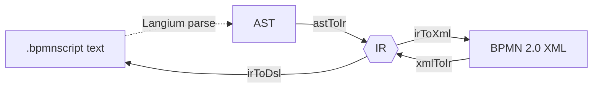

# @bpmn-script/transform

The conversion layer: the IR type definitions and the four transforms that move a process between formats.
It's the bulk of the project's hand-written code, where the `language` package is mostly generated.

Everything pivots on the IR, a small set of plain TypeScript objects in `src/ir/types.ts` that describe a process without committing to any one file format ([ADR-0007](../../docs/decisions/0007-intermediate-representation-ast-bpmn.md)).
Each transform converts between the IR and one neighboring format, so none of them has to know about any of the others.


```mermaid
flowchart LR
    DSL[".bpmnscript text"]
    AST["AST"]
    IR{{"IR"}}
    XML["BPMN 2.0 XML"]

    DSL -. "Langium parse" .-> AST
    AST -- astToIr --> IR
    IR -- irToDsl --> DSL
    IR -- irToXml --> XML
    XML -- xmlToIr --> IR
```

The four solid arrows are this package; the dotted one is the parser from `@bpmn-script/language`.
`astToIr` turns the parsed DSL into IR, `irToXml` writes deployable BPMN XML and runs auto-layout for the diagram coordinates, `xmlToIr` reads an existing BPMN file back into IR, and `irToDsl` prints IR as `.bpmnscript` text.
Compiling is `astToIr` then `irToXml`; decompiling is `xmlToIr` then `irToDsl`.

The IR names the engine settings it carries without a vendor prefix, and the `operaton:` prefix itself is applied inside `irToXml` alone.
Details the IR does not model at all, such as the process's `targetNamespace`, are attached there too.

## IR shape

The IR represents one executable BPMN process.
All types live in `src/ir/types.ts` and are re-exported from the package root.

```ts
interface BpmnProcess {
  id: string;
  name?: string;
  documentation?: string; // bpmn:documentation, carried verbatim from a single plaintext child
  isExecutable: true; // always true (executable process)
  versionTag?: string; // operaton:versionTag, an author-supplied version label
  historyTimeToLive?: string; // operaton:historyTimeToLive, absent means the exporter's default (P30D)
  candidateStarterUsers?: string; // operaton:candidateStarterUsers, comma-separated user ids stored as written
  candidateStarterGroups?: string; // operaton:candidateStarterGroups, comma-separated group ids
  isStartableInTasklist?: boolean; // operaton:isStartableInTasklist, absent means the engine default (true)
  flowElements: FlowElement[];
  sequenceFlows: SequenceFlow[];
  errorDecls?: { name: string; code: string; message?: string }[]; // every error code the process raises, catches, or declares
  escalationDecls?: { name: string; code: string }[]; // the same for escalation codes; BPMN gives an escalation no message
}

type FlowElement =
  | StartEvent // kind: 'startEvent'  (+eventDefinition?, +initiator?, +formFields?)
  | EndEvent // kind: 'endEvent'  (+eventDefinition?: a typed throw, a terminate, or a cancel)
  | UserTask // kind: 'userTask'  (+assignee?, +formKey?, +formRef?, +formFields?, +candidateGroups?/candidateUsers?/dueDate?/followUpDate?/priority?, +loop?)
  | ServiceTask // kind: 'serviceTask'  (+binding: class | expression | delegateExpression | external | decision | builtin, +resultVariable?, +element?: send | businessRule, +loop?)
  | ScriptTask // kind: 'scriptTask'  (+format, +code, +resultVariable?, +loop?)
  | Task // kind: 'task'  (no binding; the engine passes straight through; +loop?)
  | ReceiveTask // kind: 'receiveTask'  (+messageName?, absent waits for the engine's own signal API; +loop?)
  | ExclusiveGateway // kind: 'exclusiveGateway'  (+defaultFlowId?)
  | ParallelGateway // kind: 'parallelGateway'
  | InclusiveGateway // kind: 'inclusiveGateway'  (+defaultFlowId?)
  | EventBasedGateway // kind: 'eventBasedGateway'
  | SubProcess // kind: 'subProcess'  (a nested FlowContainer; +element?: 'transaction'; +loop?)
  | CallActivity // kind: 'callActivity'  (+calledElement, +binding?, +businessKey?, +mapper?, +inMappings?/outMappings?, +loop?)
  | IntermediateThrowEvent // kind: 'intermediateThrowEvent'  (an emit; +binding? on a message)
  | IntermediateCatchEvent // kind: 'intermediateCatchEvent'  (an await)
  | BoundaryEvent; // kind: 'boundaryEvent'  (attached to an activity in the same container; +cancelActivity?: false)

interface SequenceFlow {
  id: string;
  sourceRef: string; // id of source FlowElement
  targetRef: string; // id of target FlowElement
  conditionExpression?: string; // e.g. "${amount > 1000}"
}
```

Every event and activity kind above also carries the flat engine settings Operaton reads off a flow node: `asyncBefore`, `asyncAfter`, `exclusive`, `jobPriority`, and `retryCycle` (the `operaton:failedJobRetryTimeCycle` element body), plus `executionListeners`.
Only non-default values are stored, so `asyncBefore` and `asyncAfter` are `true` or absent and `exclusive` is `false` or absent.
On a node that carries a timer, `exclusive` is written on the `bpmn:timerEventDefinition` as well as on the event tag, since `BpmnParse.parseTimer` locks the timer job from the definition and the tag's copy reaches only the async continuation job; the importer takes the definition's value, falls back to the tag's, and warns once when the two are written apart ([ADR-0021](../../docs/decisions/0021-operaton-engine-attributes-as-named-ir-fields.md)).
Every gateway kind carries the five settings too, on the statement head that synthesizes it, but none of the listeners.
`ExclusiveGateway`, `ParallelGateway`, `InclusiveGateway`, and `EventBasedGateway` extend `JobSettings` directly rather than the wider `EngineAttributes`, since a listener needs the textual identity a synthesized gateway has none of ([ADR-0021](../../docs/decisions/0021-operaton-engine-attributes-as-named-ir-fields.md), [ADR-0021](../../docs/decisions/0021-operaton-engine-attributes-as-named-ir-fields.md)).
A `StartEvent` and a `UserTask` also carry `formFields`, the `operaton:formData` block: a `FormField` has a type (`string`, `number`, `boolean`, `date`, or `enum`), a label, a default, the `datePattern` a date is parsed with, an enum's `values`, its `constraints` in the order the engine validates them, each a name from the closed `FormConstraintName` union and a `config`, and its `properties`, the `operaton:property` entries ([ADR-0018](../../docs/decisions/0018-forms-and-field-injection.md)).

The seven activity kinds additionally carry `inputParameters` and `outputParameters`, the `operaton:inputOutput` block in declaration order.
An `IoParameter` is a name and one `IoValue`, tagged `text`, `script`, `list`, or `map`, so a value carrying two forms at once is unrepresentable rather than checked at runtime.
The same seven carry an optional `loop`, a `LoopCharacteristics` holding the `cardinality`, the `collection` and the `elementVariable` each run binds from it, a `completionCondition`, and `sequential`, which is `true` or absent because the engine runs the instances at once by default.
`LoopCharacteristics` also extends `JobSettings` minus `jobPriority`: the four settings a repeated statement writes onto the `multiInstanceLoopCharacteristics` element itself, read by the engine onto each run rather than around the whole repetition ([ADR-0022](../../docs/decisions/0022-repetition-the-for-clause-and-its-per-run-job-settings.md)).
A `UserTask` also carries `taskListeners`, whose events are the six points of a task's human lifecycle; `timeout` is the one that carries a timer.
An `ExecutionListener` and a `TaskListener` carry exactly one binding, tagged `class`, `expression`, `delegateExpression`, or `script`, the first three being three of the forms a service task binds by and the fourth an inline script, which no service task takes.

A `ServiceTask` binds to exactly one execution form, tagged by `binding.kind`: `class` (a Java delegate class, `operaton:class`), `expression`, `delegateExpression` (the DSL spells this one `delegate`), `external` (`operaton:type="external"` plus `operaton:topic`, written `service X(topic: "...")`), `decision` (`operaton:decisionRef` plus the shared version pinning and `mapDecisionResult`, legal only when `element` is `businessRule`), or `builtin` (`operaton:type="mail"`/`"shell"`, written `service X(type: "mail")`, a behaviour Operaton builds itself from the `fields` beside it).
The external variant alone carries `taskPriority` (`operaton:taskPriority`, an integer or an expression), `properties` (an `operaton:properties` block keyed by `name`), and `errorMappings`, each an `ErrorMapping` of the `errorCode` a `bpmn:error` root is derived for and the `condition` an `operaton:errorEventDefinition` evaluates, since `BpmnParse.parseExternalServiceTask` reads the three and no other binding reaches it ([ADR-0017](../../docs/decisions/0017-service-task-bindings.md)).
`element` picks which of the three tags this node serializes to: absent for `bpmn:serviceTask`, `'send'` for `bpmn:sendTask`, `'businessRule'` for `bpmn:businessRuleTask`.
The tagged union makes "more than one binding" unrepresentable at the type level and keeps every `switch (binding.kind)` exhaustive.
A document naming more than one is resolved the way Operaton resolves it: `operaton:type` outranks the code attributes, then `class`, then `delegateExpression`, then `expression`, and on a business rule task an `operaton:decisionRef` outranks all of them.
A `type` this surface cannot carry therefore refuses the document rather than falling back to a code attribute the engine would never reach, and whatever the winner shadows is dropped with a warning naming it.

`SubProcess` is itself a `FlowContainer`, so the IR is recursive: a sub-process nests its own `flowElements` and `sequenceFlows` at any depth, and no sequence flow crosses a container boundary.
`element` picks which of the two tags it serializes to, absent for `bpmn:subProcess` and `'transaction'` for `bpmn:transaction`, which the DSL writes with the `attempt` head.
Operaton runs the second tag through the very behavior class it gives the first, so the tag changes nothing about how the block executes; what it buys is that the engine then accepts a cancel end inside the block and a cancel boundary on it, and refuses to deploy either anywhere else.

Event semantics ride on an `eventDefinition` field, optional on a start or end event and required on an intermediate throw, an intermediate catch, and a boundary event.
`terminate` and `cancel` join the union on an end event alone and are both payload-free: one stops every running path of its scope at once and the other gives up the block the end sits in.
Neither raises anything for a handler to catch by name, which is why the surface spells both on `end` instead of `throw`.
Compensation is the odd one out, because BPMN expresses it through `isForCompensation` and an association rather than a boundary event: every holder may carry it except `BoundaryEvent`.
`IntermediateCatchEvent` is restricted to message, signal, timer, condition, or link: the first four are the triggers a linear flow can block on and then continue past ([ADR-0026](../../docs/decisions/0026-intermediate-catch-events.md)), and link is the catching end of a pair added for the import direction ([ADR-0030](../../docs/decisions/0030-link-events-for-import-round-trip-symmetry.md)).
The document-level `bpmn:Error`, `bpmn:Escalation`, `bpmn:Message`, and `bpmn:Signal` roots are synthesized rather than modeled ([ADR-0023](../../docs/decisions/0023-event-roots-from-usage-and-declared-codes.md), [ADR-0024](../../docs/decisions/0024-event-trigger-payloads-paren-slot.md)).
A message or signal root comes from the names in use, an error or escalation root from the codes in use together with `errorDecls` and `escalationDecls`, which is where a declared root's `name` and message text live.

`IntermediateCatchEvent` is a one-in, one-out node on the main flow, the topological twin of `IntermediateThrowEvent` and differing only in whether the token fires forward immediately or waits.
A link pair is the one exception: no flow leaves a link throw and none enters a link catch, and both carry `linkName`, the one fact that pairs them, since the engine matches the two ends by name in a table it keeps per deployed file.
The catch's id is the synthesized `Catch_<coord>` unless the `await` carries a name, which is what lets an imported catch keep the id it came with.

A token appears at a `BoundaryEvent` while its host activity (named by `attachedToRef`, a flow element of the same container) is running, entering from the host when the trigger fires rather than by traversing a sequence flow into it.
[ADR-0014](../../docs/decisions/0014-restructure-the-ir-into-a-dsl-with-dominator-analysis.md) covers how the restructuring analysis treats that second control-flow entry, and [ADR-0027](../../docs/decisions/0027-boundary-events-attached-to-an-activity.md) the rest of the construct.
`cancelActivity` mirrors `StartEvent.isInterrupting` in storing only the non-default `false`, an `alongside` boundary.

## Public API

```ts
import { astToIr, irToXml, xmlToIr, irToDsl } from '@bpmn-script/transform';

const ir: BpmnProcess = astToIr(langiumAstModel); // sync
const xml: string = await irToXml(ir); // async; adds bpmndi: layout data
const { ir: imported, warnings } = await xmlToIr(xmlString); // async; discards DI, may throw
const { source, warnings: printWarnings } = irToDsl(ir); // sync; warns for what it cannot carry into the script
```

`src/index.ts` is the public surface, summarized here: the IR types, `isGateway` and `gatewayDefaultFlowId` for reading them at runtime, the deterministic id helpers, the JUEL parser (`parseJuel`, `renderRawFallback`), the `Unsupported*Error` classes, `LayoutError`, and the `ImportWarning` and `PrintWarning` types.

## The import contract

`xmlToIr` never discards an element without saying so.
What it cannot represent falls into two buckets, split where the engine's own parse splits them ([ADR-0012](../../docs/decisions/0012-honest-bpmn-import.md)).

Content the IR cannot express at all is refused: `xmlToIr` throws a subclass of `UnsupportedConstructError` before producing any IR, so there is no partial output.
Content Operaton refuses to deploy is refused the same way, since there is nothing that runs to write back, and the message names the engine method that fails the deployment.
A document whose root is not `bpmn:definitions` or a sequence flow whose `sourceRef` or `targetRef` resolves to nothing is malformed rather than unsupported and throws a plain `Error`, which the CLI reports as a parse failure and exits `2`.
Content the IR does not carry (an extra Operaton extension attribute, a lane, a text annotation) comes back through the `warnings` array instead.
Every drop of a setting the engine reads names the method that reads it and says the document written back runs without it, so a reader can tell a cosmetic drop from one that changes what runs.

The diagram interchange data aside ([ADR-0009](../../docs/decisions/0009-auto-layout-and-expansion-hint.md)), no element is dropped in silence.
Every BPMN element and every extension element `xmlToIr` cannot carry is reported, named by the tag the document spells and by its own id, and attributed to the element it sat on.
A construct is reported whole, so a dropped `bpmn:ioSpecification` names itself rather than each data input inside it.
The lane structure goes the same way, reported lane by lane, with anything hung on a lane or a lane set leaving with it.

The `camunda` namespace is read as the `operaton` namespace, attributes and elements alike, since `BpmnParse.OPERATON_BPMN_EXTENSIONS_NS` falls back to the camunda URI wherever the operaton spelling is absent.
The namespace URI is swapped in the document's `xmlns` declarations before it is parsed (the same URI inside a documentation body is text and stays), one warning per document says so, and the document written back carries `operaton:` alone.
A file declaring both prefixes reads both as one namespace, and the one setting written under both prefixes on one element keeps the later one.
A connector is refused under either prefix wherever it sits: beside a service, send, or business rule task's implementation, and on a thrown message.

What is dropped without a warning is an attribute `xmlToIr` does not read, and it comes in two shapes.
One is an attribute in a foreign namespace written directly on a mapped BPMN element, which is where an editor parks its own bookkeeping.
The same attribute on an Operaton extension element the IR reads is reported, a whole foreign-namespace extension element is reported too, and an attribute written in no namespace at all that BPMN does not declare is reported as well, since no editor writes there.
The other is a BPMN attribute this surface neither reads nor reports: a process's `processType` or `isClosed`.
Each of those is content left out.
A lone `operaton:resource` on a sequence flow's condition expression or a conditional event definition's condition is the one exception that is reported rather than dropped: Operaton reads it only alongside a `language`, so on its own it reaches nothing, and the condition still imports as the expression its body writes.
`isExecutable="false"`, whose import changes what the document says, is reported instead of left for the reader to notice, and so is an absent `isExecutable`, which `BpmnParse.parseProcessDefinitions` defaults to `!deployment.isNew()` and therefore reads as false in every deployment of a new resource, skipping the process.
An absent `operaton:historyTimeToLive` is reported for the same reason: `HistoryTimeToLiveParser.parseAndValidate` refuses it under the engine's default `enforceHistoryTimeToLive`, and the export writes `P30D` in its place, so the rebuilt process deploys where the source did not.

### Refusals

Every class below extends `UnsupportedConstructError`, so catching that one classifies any refusal.
`src/errors.ts` carries the per-class detail and `src/xml-to-ir.ts` the exact conditions.

`UnsupportedDocumentError` covers a document Operaton refuses to deploy whole, or one this tool cannot read as one process.
That is a `<!DOCTYPE>` declaration, which `Parser.setXxeProcessing` disallows, and an entity reference XML does not predefine, which the engine's parse fails on.
It is an `isSequential` or `triggeredByEvent` value outside `true` and `false`, which `Parse.execute`, the validating parse against `BPMN20.xsd`, refuses.
It is an id written on two elements, which the same validation refuses as a duplicate `xs:ID`, and an id outside the ASCII letters, digits, `_`, `-`, and `.` this tool reads, where the schema admits any letter.
It is a `bpmn:import`, which `BpmnParse.parseImports` fails on for every type but WSDL.
It is a process without an id, and a start event, a timer event, an event-based gateway, or a message or signal boundary event without one, which Operaton fails the deployment on.
It is also an error, escalation, cancel or conditional boundary event without an id, which Operaton deploys and then fails the run on, and the message names the method that fails it; an id minted for it would make the rebuilt document run where the source does not.
Any other flow element without an id imports under a minted one, and a compensation boundary event among them is then refused like every compensation boundary event ([ADR-0010](../../docs/decisions/0010-deterministic-synthesized-ids.md)).
A refusal names such an element by its tag and container, as in `(a bpmn:userTask without an id in 'p')`, since the minted id appears nowhere in the file.
And it is no `bpmn:process` at all, or several processes of which none is marked `isExecutable="true"`, which `parseProcessDefinitions` deploys none of.
The first three of those are refused by `refuseDocumentShapes` on the raw document text, before it is parsed, on a copy with the comments and CDATA sections cut out, so a `<!DOCTYPE` or an `&name;` inside a script body does not refuse the file.

`UnsupportedCollaborationError` covers two or more processes marked `isExecutable="true"`: `parseProcessDefinitions` deploys each of them and the IR holds one.

`UnsupportedElementError` covers an element kind outside the supported subset, such as `bpmn:adHocSubProcess` or `bpmn:complexGateway`.

`UnsupportedServiceTaskFormError` covers a service, send, or business rule task that carries no execution binding the engine would reach, that carries an `operaton:type` outside `external`, `mail`, and `shell`, or that carries an `<operaton:connector>` element beside its implementation attributes, which the Connect plugin runs in their place.
A mail or shell task refuses when it misses a field its behaviour's parse requires, names a field its behaviour class does not declare, or carries a shell field as an expression or a flag outside `true`/`false`.
A thrown message refuses on a binding shape this tool cannot read, a `mail`/`shell` type included, since a thrown message has no member block to carry the fields either requires ([ADR-0017](../../docs/decisions/0017-service-task-bindings.md)).
A service, send, or business rule task without a decision reference refuses when it carries `operaton:resultVariable`, or the older `operaton:resultVariableName`, beside `operaton:class` or `operaton:delegateExpression`, which `BpmnParse.parseServiceTaskLike` refuses to deploy ([ADR-0017](../../docs/decisions/0017-service-task-bindings.md)).
A business rule task refuses on an `operaton:decisionRefTenantId`, which pins the tenant `BpmnParse.parseTenantId` resolves the decision against, on an `operaton:mapDecisionResult` outside the four words the engine maps, and on a `decisionRefBinding` of `version` without a version or of `versionTag`.

`UnsupportedFormFieldTypeError` covers a form field typed outside `string`/`long`/`boolean`/`date`/`enum`.

`UnsupportedFormFieldConstraintError` covers a form field constraint the engine refuses to deploy or the script cannot spell.
That is a constraint with no name, or a name outside the seven the surface takes, since `FormValidators.createValidator` fails the deployment on any name it has not registered.
It is also a `validator` or a bound with no `config`, and a name repeated on one field, which `DefaultFormHandler.parseValidation` deploys and this script holds once per field.

`UnsupportedFormReferenceError` covers a user task naming both a form key and a form reference, and a form reference with no binding, one outside `latest`, `deployment`, and `version`, or a `version` binding naming no version.

`UnsupportedCallActivityError` covers a call activity naming neither a `calledElement` nor an `operaton:caseRef`, or both, which `BpmnParse.parseCallActivity` refuses to deploy.
It covers one naming a `caseRef` alone, which the engine runs through `CaseCallActivityBehavior` and this surface has no form for.
It covers a `calledElementTenantId`, which pins the tenant `parseTenantId` resolves the called process against, and `calledElementBinding="version"` without a version or `="versionTag"`, which this surface has no setting for.
And it covers an `operaton:in`/`out` carrying a `variables` other than `all`, a `source=""`, which `parseCallableElementProvider` refuses, a `source` or `sourceExpression` with no `target`, or none of the recognized shapes.

`UnsupportedEventDefinitionError` covers an event definition of the wrong kind for its position.

`UnsupportedEventFeatureError` covers an event of the right kind in a shape the surface cannot express or the engine refuses to deploy.
The conditions below are the ones a reader meets most; `src/xml-to-ir.ts` holds the full list.
Among them, on the surface's side, is a process start carrying an error, escalation, or compensation trigger, which Operaton ignores, a message start whose name is an expression, a sub-process start carrying a trigger, and a second start event in a sub-process or transaction.
A thrown message refuses when it carries a connector, and when its `resultVariable` sits beside `operaton:expression`, under which `parseServiceTaskLike` stores the expression's value and the script's throw has no slot for it.
A link definition naming no link refuses, and so does a sequence flow leaving a link throw or entering a link catch.
A branch of a wait with several branches that leads to anything other than another wait refuses, and so does a branch-opening wait that another path also flows into.
A compensation boundary event or an `isForCompensation` activity refuses, with the `subprocess`/`on compensation` rewrite named when the two pair up through a `bpmn:association`.
A cancel boundary carrying `cancelActivity="false"` refuses.
An error root carrying an `operaton:errorMessage` and no code refuses, since nothing can key the message, and so do two error roots declaring one code with two different messages, since usage cannot recover which text was meant.
A `messageRef` or `signalRef` naming no root refuses, as one written with a prefix does, since `BpmnParse.resolveName` maps a prefix through the xmlns table and this tool matches the id as written.
On the engine's side, each naming the method: two or more plain or timer starts on the process (`selectInitial`), and a process or a sub-process with no start (`parseStartEvents`).
A sequence flow into or out of an event handler refuses (`parseSequenceFlow`), and so does a thrown message's `resultVariable` beside `operaton:class` or `operaton:delegateExpression` (`parseServiceTaskLike`).
An error end with no `errorRef` refuses, and so does an error or escalation throw whose root carries no code (`parseEndEvents`, `parseIntermediateThrowEvent`).
An escalation throw with no `escalationRef` or one naming no root refuses, and so does an escalation catch naming no root (`findEscalationForEscalationEventDefinition`, `createEscalationEventDefinitionForEscalationHandler`).
Two `bpmn:signal` roots sharing a name refuse (`parseSignals`).
A cancel definition refuses on an end outside a `bpmn:transaction`, on a boundary whose host is not one, and on a second cancel boundary of one block.
A wait with several branches carrying `operaton:asyncAfter` refuses (`parseEventBasedGateway`, [ADR-0021](../../docs/decisions/0021-operaton-engine-attributes-as-named-ir-fields.md)).

`UnsupportedGatewayShapeError` covers an exclusive gateway whose outgoing flows `BpmnParse.validateExclusiveGateway` fails the deployment on, quoting the engine's own sentence: no outgoing flow, one outgoing flow carrying a condition, a default flow carrying a condition, or a flow without a condition that is not the default, beside a default or beside another unconditioned flow.
One conditioned flow beside one plain flow with no default imports, since the engine deploys it and takes the plain flow as the default.

`UnsupportedLoopCharacteristicsError` covers a multi-instance repetition on an event handler, which its trigger enters rather than repeats, and a multi-instance repetition anywhere in a shape this surface cannot write back.
That is an `operaton:outputParameter` beside it, which `BpmnParse.checkActivityOutputParameterSupported` fails the deployment on, a `bpmn:loopCardinality` body or an element name it cannot spell, or a combination Operaton refuses to deploy.

`UnsupportedExtensionFormError` covers extension content in a shape this surface cannot write or the engine refuses.
On the surface's side, that is an input/output value form it cannot write, a listener naming no binding or an event outside its position's, a `timeout` listener with no timer or two, and an injected field naming no value slot or both of its literal ones.
It is a form field `id` or an input/output parameter `name` the script cannot spell (letters, digits, `_`, an inner `-`, no keyword), since the engine sets the variable under that name.
It is two input or two output parameters sharing a name, which `IoMapping.executeInputParameters` runs both of with the last write winning.
It is a script naming a deployment resource, which `ScriptUtil.getScript` runs in place of the body, and a script body containing three consecutive backticks, which no fence this language has can enclose.
On the engine's side, each naming the method: an `operaton:inputOutput` on a start event or a boundary event (`ensureNoIoMappingDefined`), on any gateway or on an event handler (`checkActivityInputOutputSupported`), and an `operaton:outputParameter` on an end event (`checkActivityOutputParameterSupported`).
A second `operaton:inputOutput`, `operaton:formData`, `operaton:properties`, or `operaton:failedJobRetryTimeCycle` on one element refuses, since `Element.elementNS` throws on it; the retry cycle's reader runs on an async step, a timer-driven event or a typed throw alone, and the refusal says so rather than gating on it.
An execution listener with `class=""` or `delegateExpression=""` refuses (`parseExecutionListener`), and so does a `jobPriority` or `taskPriority` that is neither an integer nor an expression (`parsePriority`).
A script task with an empty `scriptFormat` or with neither a body nor a resource refuses (`ScriptUtil.getScript`).

`UnsupportedErrorMappingError` covers an `operaton:errorEventDefinition` on an external task carrying an `errorRef` and no `expression`, which `parseOperatonErrorEventDefinitions` fails the deployment on, and an `errorRef` naming an error root with no code.

`UnsupportedAssignmentError` covers a user task carrying a `bpmn:humanPerformer` beside `operaton:assignee`, which `parseUserTaskCustomExtensions` refuses as a duplicate assignee, and more than one `bpmn:humanPerformer`, which `parseHumanPerformer` refuses.

`UnsupportedConditionExpressionError` covers a sequence flow's condition or a conditional event definition's condition carrying a `language`, which Operaton evaluates in a script engine rather than as the UEL expression this tool writes, and one typed through `xsi:type` as anything but `tFormalExpression`, which `parseConditionExpression` fails the deployment on.

### Import warnings

`xmlToIr` returns `{ ir, warnings }`, and each `ImportWarning` names one construct the import dropped or changed, or one it carried whole that the engine will not run as written.
`warnings` is `[]` for input that round-trips cleanly.

```ts
interface ImportWarning {
  elementId: string; // BPMN id of the element the dropped content was attached to
  category:
    | 'extensionAttribute'
    | 'lane'
    | 'label'
    | 'unreferencedRoot'
    | 'documentation'
    | 'unmappedConstruct'
    | 'rewritten'
    | 'behaviourChanged'
    | 'carriedAsWritten';
  message: string; // names the concrete construct
}
```

`extensionAttribute` covers an Operaton extension the IR does not read off the element carrying it: an `operaton:` element the moddle extension does not declare, a foreign vendor namespace, and an attribute with no IR field at all such as `operaton:formHandlerClass`.
The question is asked per owner kind, so an `operaton:formData` on a service task is reported: no IR node reads it there.
Where the owner is one the engine does read the setting on, the warning names the reader and says the document written back runs without it.
That is an execution listener on the process (`BpmnParse.parseExecutionListenersOnScope`), on a sequence flow (`parseExecutionListenersOnTransition`), or on any gateway kind.
It is an `operaton:inputOutput` on an intermediate catch, an intermediate throw, or an end event (`parseActivityInputOutput`).
It is `formKey`, `formRef`, its binding and version, or `formHandlerClass` on the process's own start (`parseStartFormHandlers`), and `jobPriority` or `taskPriority` on the process (`parseProcess`).
And it is `async` or an `operaton:in` payload on a thrown signal (`parseSignalEventDefinition`).
A `failedJobRetryTimeCycle` written as an attribute is reported with its own sentence: the engine reads the element form alone.
A timer-started event sub-process's own `exclusive`, `jobPriority`, or `retryCycle` is dropped with a warning: that copy reaches only the sub-process's async continuation job, and the `on timer` head the handler prints as spells those keys for the timer job its start event creates.
An `operaton:initiator` or an `operaton:formData` on a start that is not the process's own is reported the same way: `parseScopeStartEvent` reads no `operaton:` attribute there and `parseStartFormHandlers` runs for the process's own start alone.
It is asked again of every extension child the IR does read, so an unread attribute there is reported rather than leaving with the element that imports: an undeclared `operaton:` or foreign-namespace attribute on a listener or an input/output parameter, and the `id`/`name` decoration on an `operaton:value` list item.
An `operaton:taskListener`'s `id` is consumed without a word: on a `timeout` listener it is the key `BpmnParse.parseTimeoutTaskListener` requires and the export mints one per timeout listener from the task id, and on every other event `parseTaskListener` never reads it.
The same `operaton:value` tag on a form field is an enum value the IR reads, `id` and `name` included.
An injected field drops in three shapes: one riding a binding other than `class`, `delegate`, or a built-in `type`, since Operaton hands no field list to any other; one whose stored value disagrees with the `${` or `#{` opening that decides whether it is written back as a literal or as an expression; and one whose `operaton:expression` child opens with whitespace before the `${`, as a pretty-printer indents it, since a raw template opens directly after its quote and a quoted literal opening with an expression is refused.
A form field drops three things the engine never reads, each warning naming the method that ignores it: a `datePattern` off a `date` field, `operaton:value` children off an `enum` field, and a `config` on a `required` or `readonly` constraint.
An external task's `operaton:taskPriority`, `operaton:properties`, or `operaton:errorEventDefinition` on a service, send, or business rule task bound by class, expression, delegate expression, decision, or a built-in mail or shell type is reported here too, one warning per item, since `parseExternalServiceTask` alone reads them and the step runs without them either way.
On a thrown message the same three, and an injected field, are reported by their reader: with `operaton:type="external"` the sentence says `parseExternalServiceTask` reads it off the message definition (or off the event, for `operaton:properties`) and this surface's throw has no position for it, so the document written back runs without it; with any other binding, that the engine never reads it there.
A thrown message is a service task to the engine: `parseIntermediateThrowEvent` and `parseEndEvents` hand its message definition to `parseServiceTaskLike`, so every binding word, the injected fields, the result variable, the priority, and the error mappings are read off it, and a throw carrying the binding alone drops or refuses each of the rest.
A `resultVariable` beside `external` or no binding on a thrown message is dropped with a warning that `parseServiceTaskLike` hands it to an expression binding alone.
The `errorCodeVariable` and `errorMessageVariable` on such a definition warn as they do on a thrown error: the engine stores them and reads them off the catching definition alone.
A task's `operaton:property` is keyed by `name`, as `BpmnParseUtil.parseOperatonExtensionProperties` reads it, and a form field's by `id`, as `DefaultFormHandler.parseProperties` reads it, so each side reports the other attribute as unread; an entry missing its key or its value is skipped with a warning.
A repetition naming its collection in both the BPMN and the `operaton:` spelling keeps the one `MultiInstanceActivityBehavior.resolveNrOfInstances` reads and reports the other: when exactly one of the two is an expression (a value containing `{`), that one, since `parseMultiInstanceLoopCharacteristics` stores an expression and a variable name in two fields and the expression field is read first; otherwise the `bpmn:loopDataInputRef`, which the engine writes into the one field second.
An element variable named in both spellings keeps the `bpmn:inputDataItem`, written second into the engine's one field.
An implementation attribute that a higher-ranked one shadows is reported here too, on a service, send, or business rule task, on a thrown message, and on a call activity naming both of its variable-mapping attributes, since Operaton never reads past the binding it resolves.
An `operaton:in`/`out` on a call activity naming more than one shape keeps the one `parseCallableElementProvider` reads first and reports the rest: `variables="all"` ahead of a `source`, `sourceExpression`, or `target`, a `source` ahead of a `sourceExpression`, and a `businessKey` ahead of them all, which `parseInputParameter` takes while reading nothing else off that element; a second `businessKey` keeps the last, as `setBusinessKeyValueProvider` overwrites.
Listeners repeat freely: several on one event import in document order, which is the order `CoreModelElement.addListenerToMap` and `TaskDefinition.addTaskListener` run them in.
A listener naming two or more bindings keeps the first in the order `parseExecutionListener` and `parseTaskListener` read them (`class`, `expression`, `delegateExpression`, then an `operaton:script` child) and reports each loser.
An empty `name`, `label`, `defaultValue`, or `operaton:assignee` is read as the empty text in the same way and carried as `""`, so the document written back spells the attribute as the source did; every other reader folds an empty attribute into an absent one.
A timer under a task listener that is not a `timeout` is dropped with a warning, since `parseTaskListener` reads no event definition there.
An input/output parameter carrying body text beside one nested value keeps the nested value and reports the text, as `BpmnParseUtil.parseNestedParamValueProvider` reads it.
An engine setting or a listener on a link throw is reported here as well, one warning per item: Operaton creates no activity for a link throw and so never reads them, and the re-exported document runs the same without them.
Attribution is exact wherever moddle ties the content to its owning element; the few undeclared `operaton:` elements it cannot pin down are reported once against the process id instead, coarser but still reported.
On a call activity, `calledElementTenantId` is execution-affecting rather than cosmetic, so it is refused instead of warned about: it pins which tenant the engine resolves the called process against, so dropping it changes which process runs.
Neither variable-mapping attribute falls on that side of the boundary, since Operaton runs a mapping delegate after the declared `in` and `out` mappings rather than in place of them, so both import into the IR's `mapper` field instead ([ADR-0019](../../docs/decisions/0019-a-call-activitys-variable-mapping.md)).

`lane` covers a `bpmn:Lane`, one warning per lane, a lane nested in a `bpmn:childLaneSet` included.
The flat IR has no lane concept, so every step lands in one process and the assignment goes.

`label` covers a distinct `name` on an event handler, a typed end event, an intermediate throw, an intermediate catch, or a boundary event.
Those read from their trigger and code, so a differing label has nowhere to render.
A link event's `name` is written from its link name on export, so a `name` equal to the link name is derived and a differing one alone is reported.
A sequence flow's `name` is reported here when it differs from the label the rebuilt document derives, which is the condition's body inside its `${...}` on a conditioned flow and nothing on a plain one; `name=""`, which the Modeler writes on every unconditioned flow, is not a label.
It also covers a label on a start or an end whose id is the one the compiler mints for its container (`StartEvent_<container>`, `EndEvent_<container>`, or `EndEvent_<boundary>` for a boundary escape), since a script cannot spell that id back: the statement that would have carried the label is left out whole for a start, and for an end only at its block's tail; elsewhere the end prints under its reserved id and the print reports it.
Any other id prints, respelled if the script cannot spell it, with the print reporting the rename ([ADR-0010](../../docs/decisions/0010-deterministic-synthesized-ids.md)).

`unreferencedRoot` covers a `bpmn:Message` or `bpmn:Signal` root that nothing in the process references, a receive task's `messageRef` included.
It also covers an error or escalation root carrying no code, which nothing can key it by, unless it is an error root carrying an `operaton:errorMessage`, which refuses; one carrying a code imports as a declaration whether or not anything raises it.

`documentation` covers `bpmn:documentation` at every position where `label` above is warned, for the same reason: an event handler, a typed end event, an intermediate throw, an intermediate catch, a boundary event, and a start or an end whose id is the one the compiler mints for its container.
It also covers a `bpmn:documentation` on a position that reads no `name` at all: the definitions root, an event definition, an external task's `operaton:errorEventDefinition`, an Error/Escalation/Message/Signal root, a multi-instance loop characteristics element, and a sequence flow.
A second `bpmn:documentation` child on one element, or one whose `textFormat` is set to anything but plaintext, falls under the category regardless of position.
Everywhere else the text is carried onto the IR node alongside its `name` ([ADR-0012](../../docs/decisions/0012-honest-bpmn-import.md)).

`unmappedConstruct` covers BPMN content no reader on this transform reads, one warning per construct.
Beside the process: a `bpmn:collaboration`'s participants and message flows, which `BpmnParse.parseCollaboration` records for the diagram alone, one warning per pool naming the process it wraps and one per message flow naming its ends; a process not marked `isExecutable="true"` beside the one that is, which `parseProcessDefinitions` does not deploy either; and a root element other than the error, escalation, message, and signal roots the events resolve against, such as a `bpmn:category`, a `bpmn:dataStore`, a `bpmn:itemDefinition`, or a `bpmn:interface`.
A process holding no flow element at all imports with a warning that the printed script draws an error, since a process needs a step.
On an element it touches: an artifact on a process or sub-process (a `bpmn:textAnnotation`, its `bpmn:association`, a `bpmn:group`), a `bpmn:ioSpecification`, a `bpmn:property`, a data association, a `bpmn:auditing` or `bpmn:monitoring` block, and a resource role the engine reads nothing of.
On a user task a `bpmn:humanPerformer` and a `bpmn:potentialOwner` are read instead, the way `BpmnParse.parseTaskDefinition` reads them: the performer's formal expression is the assignee, each owner's is split as `parseCommaSeparatedList` splits it into `user(x)` candidate users and `group(x)` or bare candidate groups, and the role-derived entries come before the `operaton:` attribute's own, in the engine's order.
That split runs on the commas outside an expression alone, so a list written as one `${...}` or `#{...}` body stays a single entry.
One `rewritten` warning per role names the rewrite, since the script writes `assignee`, `candidateUsers`, and `candidateGroups` and the exported document carries the Operaton attributes alone; the engine builds the same identity links from either spelling ([ADR-0012](../../docs/decisions/0012-honest-bpmn-import.md)).
An `operaton:potentialStarter` on the process is read the same way, as `parseStartAuthorization` reads it: its formal expression is split onto `candidateStarterUsers` and `candidateStarterGroups` after the attributes' own, with one `rewritten` warning per element naming the rewrite; one carrying no formal expression is dropped, since the engine reads nothing else off it.
What the engine reads nothing of stays a drop: a `bpmn:performer` or a bare `bpmn:resourceRole`, a role with no `bpmn:formalExpression` child (a `bpmn:expression` typed `tFormalExpression` through `xsi:type` included, since the engine fetches the child by tag), a role's `resourceRef` or parameter binding, and any role on an activity other than a user task.
A `startQuantity` or `completionQuantity` other than `1` on an activity is reported here too: BPMN declares both with a default of `1` and `BpmnParse` never reads either, so the step runs as if it read `1`, which is what the source document runs.
On a repetition: the `bpmn:loopDataOutputRef`, `bpmn:oneBehaviorEventRef`, and `bpmn:noneBehaviorEventRef` references and a `behavior` other than `All`, all of which Operaton parses and then never reads, and a `language` on a `bpmn:completionCondition`, which `parseMultiInstanceLoopCharacteristics` hands to `createExpression` as bare text.
An `operaton:jobPriority` there joins them, since Operaton reads a job priority off the step and never off the repetition element.
A `bpmn:standardLoopCharacteristics`, with its `bpmn:loopCondition` child, drops whole rather than importing as a repetition: Operaton's own parser looks only for a multi-instance child there, so the activity deploys through its ordinary path and runs once regardless of what the source declared.
As a flow element in its own right: a `bpmn:dataObject` (with anything nested under it, such as a `bpmn:dataState`), a `bpmn:dataObjectReference`, or a `bpmn:dataStoreReference`, at process level and inside a sub-process alike; none of the three is something a `bpmn:sequenceFlow` can point at, so dropping it leaves no hole in the graph, and Operaton keeps process variables in its own store regardless.
On a `bpmn:transaction`: the `method` and `protocol` attributes, which Operaton never reads, and `triggeredByEvent="true"`, which it ignores on that tag and runs the block as an ordinary step of the surrounding flow.
A `bpmn:transaction` with no start event imports with one added, reported as `behaviourChanged`, since Operaton deploys it and `SubProcessActivityBehavior.execute` fails on entering it; a `bpmn:process` or a `bpmn:subProcess` with none, an empty process included, is refused, since `parseStartEvents` fails the deployment there.
On a wait with several branches: an `instantiate="true"`, and an `eventGatewayType` other than `Exclusive`, neither of which Operaton's own parser ever reads.
On any step: a `default` naming one of the step's own outgoing flows is carried, since `BpmnActivityBehavior.handleNoTransitions` takes it when no other route holds, and the printed script writes it as the fallback of the block the step's routes print as; a `default` naming any other flow is dropped with a warning, since `handleNoTransitions` finds no flow to take and fails the step.
An `operaton:errorEventDefinition` on an external task written with no `errorRef` is skipped with a warning, as `parseOperatonErrorEventDefinitions` skips it.
The category also covers an attribute written without a namespace that BPMN does not declare, attributed to the element carrying it.

`rewritten` covers content imported in a changed form that the engine reads as the source, where nothing is dropped.
One is an expression body opening with `#{` on a `bpmn:loopCardinality`, a `bpmn:completionCondition`, a `bpmn:conditionExpression`, a `bpmn:condition`, or an `operaton:errorEventDefinition`'s `expression` that the printer spells as bare DSL: the rebuilt document writes that body inside `${...}`, which Operaton evaluates identically.
Everywhere else a `#{...}` body is carried and printed back as written, a body the printer keeps quoted included.
The `camunda` namespace, when the document declares it, is reported once against the process: it was read as the `operaton` namespace and the document written back carries `operaton:` alone.
A `bpmn:manualTask` is imported through the same mapper as `bpmn:task`: `ManualTaskActivityBehavior` and `TaskActivityBehavior` differ in nothing Operaton reads, so token flow, waiting, listeners, async, and job configuration are unchanged, but `HistoricActivityInstance.getActivityType()` reports `task` where the source wrote `manualTask`, and the warning names that rewrite.
A `bpmn:intermediateThrowEvent` carrying no event definition, the Modeler's milestone marker, imports as a plain step the same way: `parseIntermediateThrowEvent` gives it `IntermediateThrowNoneEventActivityBehavior`, which only leaves, and history reports `task` where the source reports `intermediateNoneThrowEvent`.
A spelling the engine reads as one of its own is imported under the spelling this tool writes, with a warning naming the rewrite.
`operaton:async="true"` imports as `asyncBefore` (`BpmnParse.isAsyncBefore`), and `operaton:resultVariableName` as `resultVariable` (`parseResultVariable`).
A `calledElementBinding` or `decisionRefBinding` word outside the four `parseBinding` matches imports as `latest`, since `BaseCallableElement.isLatestBinding` reads no binding as latest.
An `errorRef` naming no `bpmn:error` root imports as the error code spelled by its text, on a catch, a throw, and an external task's mapping alike: `parseBoundaryErrorEventDefinition`, `parseErrorStartEventDefinition`, `parseEndEvents`, and `parseOperatonErrorEventDefinitions` each take a dangling reference's text as the code, and the rebuilt document declares an error root carrying it.
A script task with no `scriptFormat` is imported as `juel`, the `ScriptingEngines.DEFAULT_SCRIPTING_LANGUAGE` that `BpmnParse.parseScriptTaskElement` substitutes.
An injected field's `operaton:string` child is written back as a `stringValue` attribute, whose text the engine injects the same way.
A repeated enum value id on a form field is kept the way `FormTypes.parseFormPropertyType` keeps it, once at its first position with its last `name`, and a repeated `operaton:property` key once at its first position with its last value, as `DefaultFormHandler.parseProperties` and `BpmnParseUtil.parseOperatonExtensionProperties` keep it.

`behaviourChanged` covers content imported in a changed form that the engine deploys or runs differently from the source, where the warning names the difference.
`isExecutable="false"` on the process: the IR holds an executable process and nothing else, so the import and the file written back from it are both executable and an engine will run what the source document held back.
An absent `isExecutable` on a lone process is reported the same way, since `parseProcessDefinitions` skips it in a new deployment.
An absent `operaton:historyTimeToLive` is written back as `P30D`, so the rebuilt process deploys where the source, under the engine's default `enforceHistoryTimeToLive`, did not.
A `bpmn:transaction` with no start event imports with one added, so the block runs where `SubProcessActivityBehavior.execute` fails the source on entering it.
A `bpmn:conditionExpression` or `bpmn:completionCondition` body with no `${` or `#{` opener at all is written inside `${...}`, which evaluates it, where `UelExpressionCondition.evaluate` (or `MultiInstanceActivityBehavior.completionConditionSatisfied`) reads the bare text as a string and fails on every run.
An empty condition body, which fails the same way, is dropped instead: the flow imports with no condition and the rebuild routes along it.

`carriedAsWritten` covers a construct that arrived half-written and imports unchanged, with a warning that the engine deploys it and then fails or misreads it, and that the printed script draws a diagnostic there.
On a form field that is a bound on a type its validator refuses, a bound whose `config` is not an integer, and a literal enum default naming none of the values.
A literal default the field's type cannot convert goes the same way: a `number` default that is not an integer, which `LongFormType.convertValue` throws on, a `boolean` default outside `true`/`false`, which `BooleanFormType.convertValue` reads as false, and an ISO date default on a `date` field naming no pattern, which `DateFormType` parses under `dd/MM/yyyy`.
A shell task's `wait`, `redirectError`, or `cleanEnv` flag spelled in any case but lowercase, such as `wait="TRUE"`, deploys, and `ShellActivityBehavior.readFields` compares it with `"true"` case-sensitively, so the engine reads it as false.
A `resultVariable` beside an `external` or a built-in `type` binding on a task deploys and is never written, since `parseServiceTaskLike` hands it to an expression binding alone.
A script whose `scriptFormat` lies outside the fence tags this surface knows imports under that tag, and a `bpmn:script` or `operaton:script` with an empty body imports empty, since `ScriptUtil.getScript` checks the source for null and not for emptiness.
An execution listener with `expression=""` and a task listener with `class=""`, `expression=""`, or `delegateExpression=""` carry the empty text: `ExpressionExecutionListener` and `ExpressionTaskListener` evaluate it, while `ClassDelegateTaskListener` and `DelegateExpressionTaskListener` fail when the listener's event fires.
A cancel end and the cancel boundary event that catches it are wired together when Operaton parses the boundary, and nothing but such an end ever reaches such a boundary, so either half alone deploys and then goes wrong at run time.
A block holding a cancel end with no cancel boundary attached imports whole, and the warning names the error the engine stops with the first time that end is reached.
A cancel boundary on a block nothing inside gives up imports whole too, and the warning names the path that can never run.
Refusing either would reject a file the engine deploys although the rebuilt document fails the same way the source does; a boundary event without an id is refused even where it deploys, because the id minted for it would change what runs.

### Print warnings

`irToDsl` returns `{ source, warnings }`, and each `PrintWarning` names one thing the script could not carry from the IR, or one it wrote that draws an error when the source is read back.
`warnings` is `[]` for an IR that prints cleanly.
Every message keeps the id out of its text and in `elementId`, since a synthesized id routinely spells BPMN vocabulary the script keeps away from its readers.

```ts
interface PrintWarning {
  elementId: string; // id of the element the notice is about
  category:
    | 'label'
    | 'documentation'
    | 'droppedEdge'
    | 'defaultFlow'
    | 'degradedSplit'
    | 'droppedCondition'
    | 'refusedStatement'
    | 'renamedId'
    | 'droppedSetting';
  message: string; // names what was left out or changed and whether the process runs the same
}
```

`label` covers a `name` on a gateway, and `documentation` a `bpmn:documentation` on one: the script derives every split and every merge from its block structure, so there is no statement to carry either, and the process runs the same without it.
Every other elided label and documentation is reported by `xmlToIr`, so a caller printing both channels sees each drop once.

`droppedEdge` covers a route the emitter can neither name nor place: a jump into a gateway that still has a choice of its own, into a gateway the walk has already crossed, or into a step the print leaves out.
The edge is left out, and the `// unstructured region: hand-repair required` marker written where it belonged names the step it led to.

`defaultFlow` covers a split whose fallback the script cannot write as the model has it.
That is a split naming no fallback whose every route carries a condition, where the engine fails the run when none holds and the script carries on past the routes instead.
It is a fallback carrying a condition, which a fork or a step skips while weighing, so the run is the same without it, and which the engine refuses to deploy on a choice, so the script without it runs where the model as drawn does not.
And it is a fallback on an inclusive split beside an unconditioned branch, which nothing is ever left over for; the script writes it as an `else` all the same, which draws an error when the source is read back.

`degradedSplit` covers a split whose branches reach no merge the block form can close, so each branch leaves as a jump under a marker line and the split's own kind is written nowhere, and a wait with several branches of which one opens on something other than a wait the block can hold: a step of another kind, a wait already printed, or one that splits.
It also covers a gateway with no route out, which the script leaves out where the engine ends the run, stops it with an error, waits forever, or refuses to deploy, depending on the gateway's kind.

`droppedCondition` covers a condition on a route the script has no place for: a route out of a wait or out of a split that takes every route, which the engine weighs nowhere, and a route from one step straight to the next, which the engine takes only when the condition holds.
On a route beside an unconditioned fallback the model diverts the run rather than failing it, and the warning says which.

`refusedStatement` covers a step written under a name the script keeps for the ids it mints itself, a plain synthesized end printed anywhere but at the tail of the block the compiler mints it for, and a jump into a branch of an `await` or `parallel` block from outside that branch.
Each prints as the model has it and draws an error when the source is read back.

`renamedId` covers an id the script writes as a process header, a statement name, or a `goto` target and cannot spell, which prints under a minted name that no id in the document and no earlier minted name collides with.
The document built from the script carries the minted id, and the engine keys history, migration plans, and a start-before-activity on the activity id, so what runs is not the same ([ADR-0010](../../docs/decisions/0010-deterministic-synthesized-ids.md)).

`droppedSetting` covers job settings on a gateway that no statement head took over by the end of the walk, an elided pass-through or a gateway a jump was forwarded through among them.
The process runs without them.

## Build and test

```bash
# From repo root
npm run build --workspace packages/transform
npm test --workspace packages/transform

# From this directory
npm run build
npm test
```

## Source layout

| Path                       | Purpose                                                                                                                                                                          |
| -------------------------- | -------------------------------------------------------------------------------------------------------------------------------------------------------------------------------- |
| `src/ir/types.ts`          | IR type definitions (`BpmnProcess`, `FlowElement`, `SequenceFlow`, ...)                                                                                                          |
| `src/synthesize-ids.ts`    | Deterministic structural id generators; the contract is frozen ([ADR-0010](../../docs/decisions/0010-deterministic-synthesized-ids.md))                                          |
| `src/ast-to-ir.ts`         | `astToIr`: desugar the structured AST into flat IR (gateway synthesis, implicit start and end)                                                                                   |
| `src/ir-to-xml.ts`         | `irToXml`: IR to BPMN 2.0 XML with Operaton extensions and auto-layout                                                                                                           |
| `src/xml-to-ir.ts`         | `xmlToIr`: BPMN 2.0 XML to `{ ir, warnings }`                                                                                                                                    |
| `src/cfg-analysis.ts`      | `analyzeCfg`: dominator, post-dominator, and back-edge analysis for `irToDsl`                                                                                                    |
| `src/ir-to-dsl.ts`         | `irToDsl`: restructure flat IR into `{ source, warnings }`, degrading to `goto` ([ADR-0014](../../docs/decisions/0014-restructure-the-ir-into-a-dsl-with-dominator-analysis.md)) |
| `src/juel.ts`              | `parseJuel`, `renderRawFallback`: the JUEL-subset parser and serializer for the import path                                                                                      |
| `src/errors.ts`            | `UnsupportedConstructError` and its refusal subclasses                                                                                                                           |
| `src/index.ts`             | Package barrel export                                                                                                                                                            |
| `src/operaton-moddle.json` | Trimmed Operaton moddle extension descriptor ([ADR-0008](../../docs/decisions/0008-fork-camunda-moddle-extension.md))                                                            |

## Implementation notes

`irToXml` uses `bpmn-moddle@^10` and `bpmn-auto-layout@^1.2.0`.
The layout library injects the `<bpmndi:BPMNDiagram>` data, so the IR needs no coordinate fields.
When `bpmn-auto-layout` throws on a validator-clean shape (a `goto` restructuring among them), `irToXml` raises `LayoutError` rather than an `Unsupported*Error`, and its `xml` field carries the document with no `bpmndi:` element, for any process.
Operaton deploys it the same, since `BpmnParse.parseDiagramInterchangeElements` reads a diagram only when one is present.
The CLI and the extension write that document either way and report the layout failure as a warning.
Version 1.x exposes `layoutProcess(xml)` as a flat named export; the `new BpmnAutoLayout()` constructor belongs to the 0.x series and is not used here.
The Operaton namespace comes from `src/operaton-moddle.json`, a trimmed fork of the camunda-bpmn-moddle descriptor ([ADR-0008](../../docs/decisions/0008-fork-camunda-moddle-extension.md)).

`irToDsl` recognizes structured patterns through the dominator analysis in `cfg-analysis.ts`, and edges that match nothing become `goto` ([ADR-0014](../../docs/decisions/0014-restructure-the-ir-into-a-dsl-with-dominator-analysis.md)).

Every synthesized gateway, flow, and boundary-event id comes from `synthesize-ids.ts`.
Gateway and flow ids are positional, derived from the element's structural coordinate.
An unnamed throw or catch is minted a positional id the same way (`Throw_<coord>_<n>`, `Catch_<coord>_<n>`); compiling the same unnamed statement again after the printer reordered it (a multi-start chain, a hoisted branch) renumbers the id, which is cosmetic and does not change what the process runs.
A boundary event's id is host-derived instead (`Boundary_<hostId>_<trigger>`), so it survives a round trip unmoved no matter where the decompiler places the handler.
The templates are frozen: changing one means updating the round-trip normalizer and regenerating `tests/golden/invoice-approval-generated.bpmn` ([ADR-0010](../../docs/decisions/0010-deterministic-synthesized-ids.md), [ADR-0027](../../docs/decisions/0027-boundary-events-attached-to-an-activity.md)).

`juel.ts` is a hand-rolled recursive-descent parser mirroring the Langium expression sub-grammar in `bpmn-script.langium`.
It runs on the import path: `xmlToIr` reads raw `${...}` bodies, and `irToDsl` decides between native syntax and the quoted fallback.
A JUEL string literal always prints double-quoted, whichever quote character the source used; the two are equivalent to the engine (`Scanner.nextString` accepts either).

## Dependencies on other packages

- `@bpmn-script/language` (workspace) for the Langium-generated AST types `astToIr` consumes, the `renderExpression` helper, and the shared DSL vocabulary in `packages/language/src/vocabulary.ts`, so the two packages cannot drift on a word.
